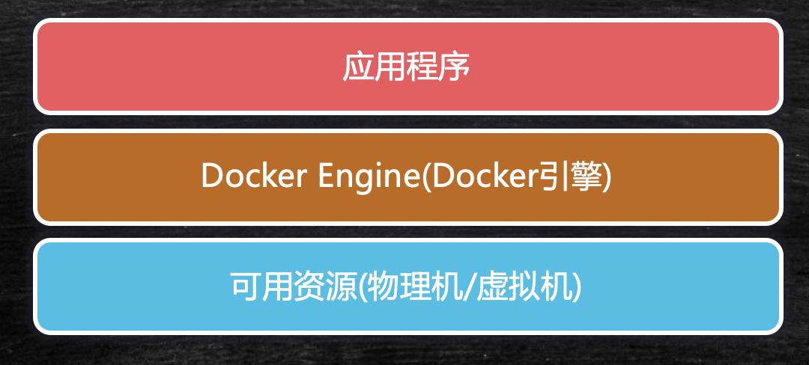
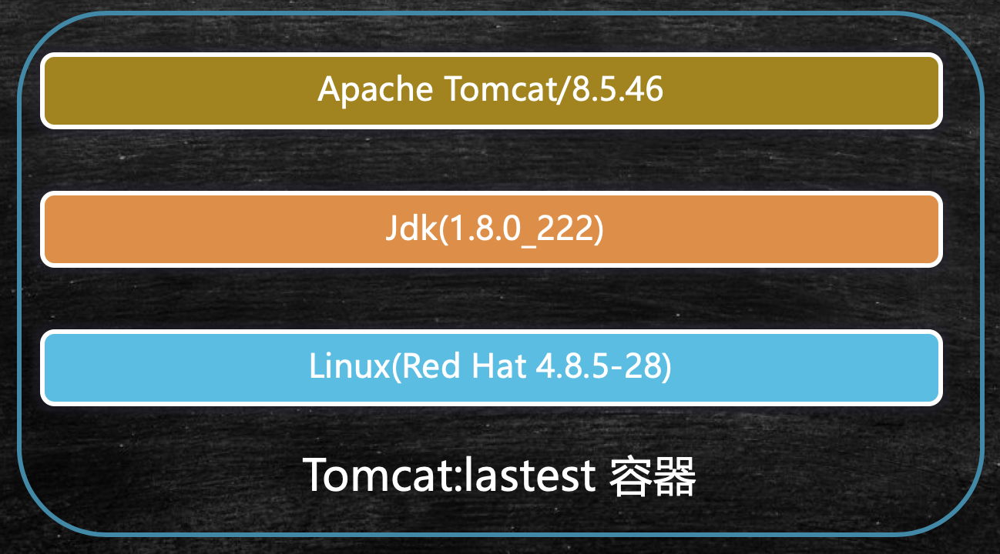
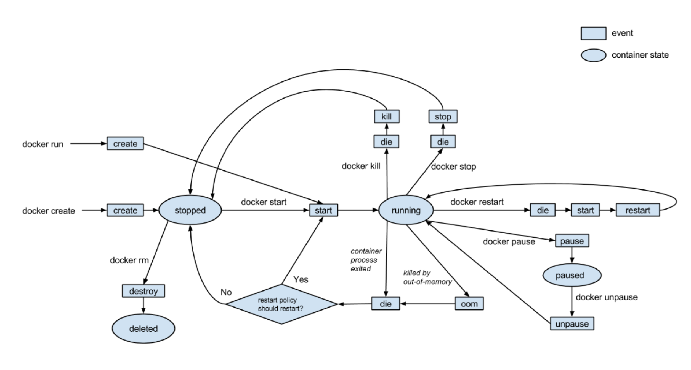

# docker

## 安装

这里选择安装的是docker19，需要使用centos7以上的linux操作系统，安装步骤:

```bash
# 准备工作
# 数据存储的驱动包
yum install -y yum-utils device-mapper-persistent-data lvm2
# 设置安装源为国内的aliyun，国外的下载速度过慢
yum-config-manager --add-repo http://mirrors.aliyun.com/docker-ce/linux/centos/docker-ce.repo	
# 检测哪个安装源速度最快
yum makecache fast

# 安装
yum -y install docker-ce
# 启动
service docker start
# 验证
docker version
docker pull hello-world
docker run hello-world	# 在看到Hello From Docker后，启动成功。
```

## 基本概念

Docker是应用打包，部署和运行应用的容器化平台。



### Docker引擎

Docker引擎的作用和Java虚拟机很相似，应用程序由Docker引擎进行统一管理，分配可用资源。

### 镜像

Image是文件，是只读的，提供了运行程序完整的软硬件资源，是应用程序的"集装箱"，可以理解为Windows系统安装盘。

### 容器

Container是镜像的实例，由Docker负责创建，容器之间彼此隔离，可以理解为具体某台PC机上安装的操作系统。

#### 内部结构

以Tomcat为例，一个Tomcat的容器内部，会安装一个微型的Linux系统，还有Tomcat运行依赖的Java环境，再加上Tomcat应用程序。




#### 生命周期

容器的详细生命周期如下图所示：

其中docker run就是docker create + docker start




#### 通信

##### 容器间的单向访问

docker每个容器都具有一个随机分配的虚拟IP，这里IP间是互通的，但是容器间的通信，是不能用这个随机IP的，需要给每个容器一个名字。这些虚拟的IP地址是由Docker统一管理的，因此只要知道这里容器的名字，就可以实现容器间的通信。

```bash
docker run -d --name web tomcat # 给启动的Tomcat一个名字叫web
docker run -d --name database -it centos /bin/bash	# 给启动的数据库一个名字叫database
docker inspect container-id	# 查看具体容器的IP地址
```

如果按以上方式启动，那么进入容器内部，只能通过IP地址互通，是不能通过名字互通的，需要增加一步操作，就是Link单向通信。

```bash
docker rm -f web-containerId
docker run -d --name web --link database tomcat	# 多加了一个--link database，再进入tomcat内部，ping database就可以了
```

##### Bridge网桥双向通信

通过网桥，容器内部可以访问外部网站，是因为网桥将数据转到宿主机的物理网卡，如果将各容器都连接到网桥，就可以实现各容器互连互通。

网桥实现原理是：

docker中创建了一块虚拟网卡（网关），所有的容器通过虚拟网关进行数据交换，但是如果需要访问外网，还是需要通过物理网卡。

```bash
docker run -d --name web tomcat
docker run -d -it --name database centos /bin/bash

# 如果需要内部容器的互通，需要创建新的网桥
docker network create -d bridge my-bridge
docker network ls	# 多出一个网桥

# 将容器和网桥进行绑定
docker network connect my-bridge web	
docker network connect my-bridge database
```

#### 共享数据

Volume容器间的共享数据

如果多个tomcat容器访问同一个文件， 需要数据共享， 在宿主机上存储文件， 每个容器都是访问的同一份文件，更新起来就会更方便。

```bash
# 如下我们创建了两个容器，当修改其实/usr/webapps的值，每个容器都会发生改变。
docker run --name t1 -v /usr/webapps:/usr/local/tomcat/webapps tomcat
docker run --name t2 -v /usr/webapps:/usr/local/tomcat/webapps tomcat
```

通过--volumes-from 共享容器内挂载点

```bash
# 创建共享容器
docker create --name webpage -v /webapps:/tomcat/webapps tomcat /bin/true
# 共享容器挂载点
docker run --volumes-from webpage --name t1 -d tomcat
```

### 远程仓库

保存各种各样的镜像文件。

## 执行流程

由Docker Client端向Docker Host发送命令，由Docker Daemon接收Client端命令，向远程仓库获取镜像文件保存在本地，再由Docker Daemon根据本地images创建容器。

## 常用命令

docker pull 镜像名<:tags> - 从远程仓库抽取镜像

docker images - 查看本地镜像

docker run 镜像名<:tags> - 创建容器，启动应用

docker ps - 查看正在运行中的镜像

docker rm <-f> 容器id - 删除容器

docker rmi <-f> 镜像名:<tags> - 删除镜像

## 通信

### Docker中容器和宿主机间的通信

Docker中容器一般会暴露一个对外服务的端口，但是这个端口是不能在宿主机中直接访问的，需要在启动时增加一个参数：

```bash
docker run -p 8000:8080 tomcat	# Tomcat容器中的8080服务对应宿主机Linux的8000端口
```

## Dockerfile

Dockerfile，镜像描述文件，是一个包含用于组合镜像的命令的文本文档，Docker会通过读取Dockerfile中的指令按步骤生成镜像文件

```bash
# 通过Dockerfile生成镜像的命令
docker build -t 机构/镜像名:<:tags> Dockerfile目录
```

### 基本命令

FROM - 基于基准镜像

LABEL & MAINTAINER - 说明信息

WORKDIR - 设置工作目录

ADD & COPY - 复制文件

ENV - 设置环境常量

EXPOSE - 暴露容器端口

```bash
FROM centos  #制作基准镜像(基于centos:lastest）
```

```dockerfile
#	dockerfile示例文件，自动部署tomcat
FROM tomcat:latest
MAINTAINER qinsheng.com
WORKDIR /usr/local/tomcat/webapps
ADD docker-web ./docker-web	# 将当前目录下的docker-web文件夹，拷贝到/usr/local/tomcat/webapps/docker-web文件夹中
```

### 镜像分层

镜像分层就是在通过dockerfile创建镜像文件时，docker会在每执行完一次命令后，保存一个临时容器，如果下次执行相同的命令时，可以直接从cache中获取，dockerfile中每个步骤可以看成是一个镜像分层。

### 执行指令

RUN : 在Build构建时执行命令，docker build 中会执行此命令

```dockerfile
RUN yum install -y vim  #Shell 命令格式
RUN ["yum","install","-y","vim"] #Exec命令格式
```

ENTRYPOINT : 容器启动时执行的命令，且只有最后一个ENTRYPOINT命令会执行。

CMD : 容器启动后执行默认的命令或参数，如果容器启动时附加指令，则CMD被忽略。

对于后两者，可以组合使用，假如我们有一个dockerfile如下，那么不同的组合，执行结果也是不同的：

```dockerfile
FROM centos
RUN ["echo", "image building"]
ENTRYPOINT["ps"]
CMD ["-ef"]	# 查看进行的完整参数
```

```bash
docker build -t mashibing.com/docker_run # 构建镜像时，只有run命令会执行
docker run mashinbing.com/docker_run  # 启动时，执行ps -ef
docker run mashiginb.com/docker_run -aux # 这里就会用-aux替换cmd的-ef，执行ps -aux
```

#### Shell指令和Exec运行方式

使用Shell执行时，当前shell是父进程，生成一个子shell进程，在子shell中执行脚本。脚本执行完毕，退出子shell，回到当前shell。

使用Exec方式，会用Exec进程替换当前进程，并且保持PID不变，执行完毕，直接退出，并不会退回之前的进程环境。

## 实验

### 构建Redis镜像

我们可以轻松地从docker仓库中获取Redis镜像，这里只是为了实验，编写dockerfile，并由dockerfile生成镜像文件并生成容器。

```dockerfile
FROM centos
RUN ["yum", "install", "-y", "gcc", "gcc-c++", "net-tools", "make"]
WORKDIR /usr/local
ADD redis-4.0.14.tar.gz .
WORKDIR /usr/local/redis-4.0.14/src
RUN make && make install
WORKDIR /usr/local/redis-4.0.14
ADD redis-7000.conf .	# 拷贝配置文件
EXPOSE 7000	# 暴露端口7000
CMD ["redis-server", "redis-7000.conf"]	# 使用当前目录的redis-7000.conf启动redis服务
```

## docker compose

### 安装

# kubenates