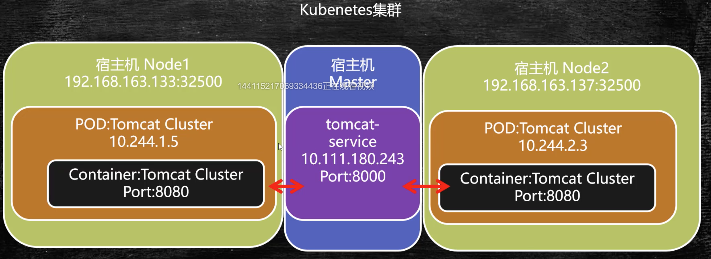

#  docker

## 安装

这里选择安装的是docker19，需要使用centos7以上的linux操作系统，安装步骤:

```bash
# 准备工作
# 数据存储的驱动包
yum install -y yum-utils device-mapper-persistent-data lvm2
# 设置安装源为国内的aliyun，国外的下载速度过慢
yum-config-manager --add-repo http://mirrors.aliyun.com/docker-ce/linux/centos/docker-ce.repo	
# 检测哪个安装源速度最快
yum makecache fast

# 安装
yum -y install docker-ce
# 启动
service docker start
# 验证
docker version
docker pull hello-world
docker run hello-world	# 在看到Hello From Docker后，启动成功。
```

## 基本概念

Docker是应用打包，部署和运行应用的容器化平台。


### Docker引擎

Docker引擎的作用和Java虚拟机很相似，应用程序由Docker引擎进行统一管理，分配可用资源。

### 镜像

Image是文件，是只读的，提供了运行程序完整的软硬件资源，是应用程序的"集装箱"，可以理解为Windows系统安装盘。

### 容器

Container是镜像的实例，由Docker负责创建，容器之间彼此隔离，可以理解为具体某台PC机上安装的操作系统。

#### 内部结构

以Tomcat为例，一个Tomcat的容器内部，会安装一个微型的Linux系统，还有Tomcat运行依赖的Java环境，再加上Tomcat应用程序。


#### 生命周期

容器的详细生命周期如下图所示：

其中docker run就是docker create + docker start


#### 通信

##### 容器间的单向访问

docker每个容器都具有一个随机分配的虚拟IP，这里IP间是互通的，但是容器间的通信，是不能用这个随机IP的，需要给每个容器一个名字。这些虚拟的IP地址是由Docker统一管理的，因此只要知道这里容器的名字，就可以实现容器间的通信。

```bash
docker run -d --name web tomcat # 给启动的Tomcat一个名字叫web
docker run -d --name database -it centos /bin/bash	# 给启动的数据库一个名字叫database
docker inspect container-id	# 查看具体容器的IP地址
```

如果按以上方式启动，那么进入容器内部，只能通过IP地址互通，是不能通过名字互通的，需要增加一步操作，就是Link单向通信。

```bash
docker rm -f web-containerId
docker run -d --name web --link database tomcat	# 多加了一个--link database，再进入tomcat内部，ping database就可以了
```

##### Bridge网桥双向通信

通过网桥，容器内部可以访问外部网站，是因为网桥将数据转到宿主机的物理网卡，如果将各容器都连接到网桥，就可以实现各容器互连互通。

网桥实现原理是：

docker中创建了一块虚拟网卡（网关），所有的容器通过虚拟网关进行数据交换，但是如果需要访问外网，还是需要通过物理网卡。

```bash
docker run -d --name web tomcat
docker run -d -it --name database centos /bin/bash

# 如果需要内部容器的互通，需要创建新的网桥
docker network create -d bridge my-bridge
docker network ls	# 多出一个网桥

# 将容器和网桥进行绑定
docker network connect my-bridge web	
docker network connect my-bridge database
```

#### 共享数据

Volume容器间的共享数据

如果多个tomcat容器访问同一个文件， 需要数据共享， 在宿主机上存储文件， 每个容器都是访问的同一份文件，更新起来就会更方便。

```bash
# 如下我们创建了两个容器，当修改其实/usr/webapps的值，每个容器都会发生改变。
docker run --name t1 -v /usr/webapps:/usr/local/tomcat/webapps tomcat
docker run --name t2 -v /usr/webapps:/usr/local/tomcat/webapps tomcat
```

通过--volumes-from 共享容器内挂载点

```bash
# 创建共享容器
docker create --name webpage -v /webapps:/tomcat/webapps tomcat /bin/true
# 共享容器挂载点
docker run --volumes-from webpage --name t1 -d tomcat
```

### 远程仓库

保存各种各样的镜像文件。

## 执行流程

由Docker Client端向Docker Host发送命令，由Docker Daemon接收Client端命令，向远程仓库获取镜像文件保存在本地，再由Docker Daemon根据本地images创建容器。

## 常用命令

docker pull 镜像名<:tags> - 从远程仓库抽取镜像

docker images - 查看本地镜像

docker run 镜像名<:tags> - 创建容器，启动应用

docker ps - 查看正在运行中的镜像

docker rm <-f> 容器id - 删除容器

docker rmi <-f> 镜像名:<tags> - 删除镜像

## 通信

### Docker中容器和宿主机间的通信

Docker中容器一般会暴露一个对外服务的端口，但是这个端口是不能在宿主机中直接访问的，需要在启动时增加一个参数：

```bash
docker run -p 8000:8080 tomcat	# Tomcat容器中的8080服务对应宿主机Linux的8000端口
```

## Dockerfile

Dockerfile，镜像描述文件，是一个包含用于组合镜像的命令的文本文档，Docker会通过读取Dockerfile中的指令按步骤生成镜像文件

```bash
# 通过Dockerfile生成镜像的命令
docker build -t 机构/镜像名:<:tags> Dockerfile目录
```

### 基本命令

FROM - 基于基准镜像

LABEL & MAINTAINER - 说明信息

WORKDIR - 设置工作目录

ADD & COPY - 复制文件

ENV - 设置环境常量

EXPOSE - 暴露容器端口

```bash
FROM centos  #制作基准镜像(基于centos:lastest）
```

```dockerfile
#	dockerfile示例文件，自动部署tomcat
FROM tomcat:latest
MAINTAINER qinsheng.com
WORKDIR /usr/local/tomcat/webapps
ADD docker-web ./docker-web	# 将当前目录下的docker-web文件夹，拷贝到/usr/local/tomcat/webapps/docker-web文件夹中
```

### 镜像分层

镜像分层就是在通过dockerfile创建镜像文件时，docker会在每执行完一次命令后，保存一个临时容器，如果下次执行相同的命令时，可以直接从cache中获取，dockerfile中每个步骤可以看成是一个镜像分层。

### 执行指令

RUN : 在Build构建时执行命令，docker build 中会执行此命令

```dockerfile
RUN yum install -y vim  #Shell 命令格式
RUN ["yum","install","-y","vim"] #Exec命令格式
```

ENTRYPOINT : 容器启动时执行的命令，且只有最后一个ENTRYPOINT命令会执行。

CMD : 容器启动后执行默认的命令或参数，如果容器启动时附加指令，则CMD被忽略。

对于后两者，可以组合使用，假如我们有一个dockerfile如下，那么不同的组合，执行结果也是不同的：

```dockerfile
FROM centos
RUN ["echo", "image building"]
ENTRYPOINT["ps"]
CMD ["-ef"]	# 查看进行的完整参数
```

```bash
docker build -t mashibing.com/docker_run # 构建镜像时，只有run命令会执行
docker run mashinbing.com/docker_run  # 启动时，执行ps -ef
docker run mashiginb.com/docker_run -aux # 这里就会用-aux替换cmd的-ef，执行ps -aux
```

#### Shell指令和Exec运行方式

使用Shell执行时，当前shell是父进程，生成一个子shell进程，在子shell中执行脚本。脚本执行完毕，退出子shell，回到当前shell。

使用Exec方式，会用Exec进程替换当前进程，并且保持PID不变，执行完毕，直接退出，并不会退回之前的进程环境。

## 实验

### 构建Redis镜像

我们可以轻松地从docker仓库中获取Redis镜像，这里只是为了实验，编写dockerfile，并由dockerfile生成镜像文件并生成容器。

```dockerfile
FROM centos
RUN ["yum", "install", "-y", "gcc", "gcc-c++", "net-tools", "make"]
WORKDIR /usr/local
ADD redis-4.0.14.tar.gz .
WORKDIR /usr/local/redis-4.0.14/src
RUN make && make install
WORKDIR /usr/local/redis-4.0.14
ADD redis-7000.conf .	# 拷贝配置文件
EXPOSE 7000	# 暴露端口7000
CMD ["redis-server", "redis-7000.conf"]	# 使用当前目录的redis-7000.conf启动redis服务
```

## docker compose

容器编排工具，Docker Compose是Docker官方提供的单机编排工具，Docker Swarm是官方提供的集群编排工具。

### 安装

# kubenates

k8s也是**集群编排工具**，是和Docker Swarm功能一样的。

## 主要功能

自动化容器部署和复制

随时扩展和收缩容器规模

容器分组Group，提供容器间的负载均衡

实时监控

## 基本概念

**主节点**： Kubenates Master，k8s有一个主节点和N个节点，主节点一般为一台独立的物理机。

**节点**：Node，每个节点都会需要安装kubelet，运行k8s命令，kube-proxy，实现Node间的通信，docker，任何容器技术都是基于docker的。

**Pod**：在Docker中，容器是控制的最小单元，在k8s中，Pod是控制的最小单元，一个Pod就是一个进程，拥有自己独立的资源。

Pod其实是容器的容器，就是Container的容器，Pod内部容器是网络互通的，但是不同Pod间的Container是不互通的。

每个Pod拥有独立的虚拟IP，部署的都是完整的应用或模块。

**Pause**：Pause是Pod内部除了Container之外的，提供内部Container的数据互通（使用localhost就可以）和提供Volumn挂载数据。

**Label**：Pod别名。

**Replicate Controller**：监控Containers，是否需要创建新的，是否有Pod需要重启，等。

**Service**：实现了跨主机，跨容器间的网络通信。

## 安装

由于国内网络不能直接连接Google中央仓库，使用Kubeadmin通过离线镜像安装比较合适。

### 环境准备

因为k8s是集群编排工具，自然不会只有一台Linux虚拟机，需要准备三台：

master：主服务器

node1：节点服务器

node2：节点服务器

#### 设置主机名和时区

```bash
# 设置主机名与时区
timedatectl set-timezone Asia/Shanghai  # 都要执行
hostnamectl set-hostname master   # 132执行
hostnamectl set-hostname node1    # 133执行
hostnamectl set-hostname node2    # 137执行
```

#### 网络设置

```bash
# 添加hosts网络主机配置,三台虚拟机都要设置
vim /etc/hosts
192.168.163.132 master
192.168.163.133 node1
192.168.163.137 node2
```

#### 关闭防火墙

```bash
# 关闭防火墙，三台虚拟机都要设置，生产环境跳过这一步
# SELINUX 是安全增强型的Linux
sed -i 's/SELINUX=enforcing/SELINUX=disabled/g' /etc/selinux/config
setenforce 0
systemctl disable firewalld
systemctl stop firewalld
```

### 安装Kubeadm

#### 上传安装文件

将镜像包上传至服务器每个节点。

```bash
mkdir /usr/local/k8s-install
cd /usr/local/k8s-install
```

#### 安装Docker

```bash
tar -zxvf docker-ce-18.09.tar.gz
cd docker 
yum localinstall -y *.rpm	# rpm安装文件，加载当前目录下的所有rpm文件
systemctl start docker
systemctl enable docker
```

```bash
# 确保从cgroups均在同一个从groupfs
# cgroups是control groups的简称，它为Linux内核提供了一种任务聚集和划分的机制，通过一组参数集合将一些任务组织成一个或多个子系统。   
# cgroups是实现IaaS虚拟化(kvm、lxc等)，PaaS容器沙箱(Docker等)的资源管理控制部分的底层基础。
# 子系统是根据cgroup对任务的划分功能将任务按照一种指定的属性划分成的一个组，主要用来实现资源的控制。
# 在cgroup中，划分成的任务组以层次结构的形式组织，多个子系统形成一个数据结构中类似多根树的结构。cgroup包含了多个孤立的子系统，每一个子系统代表单一的资源

docker info | grep cgroup 

# 如果不是groupfs,执行下列语句
cat << EOF > /etc/docker/daemon.json
{
  "exec-opts": ["native.cgroupdriver=cgroupfs"]
}
EOF
systemctl daemon-reload && systemctl restart docker
```

#### 安装kubeadm

kubeadm是集群部署工具

```bash
cd /usr/local/k8s-install/kubernetes-1.14
tar -zxvf kube114-rpm.tar.gz
cd kube114-rpm
yum localinstall -y *.rpm
```

#### 关闭交换区

```bash
swapoff -a
vi /etc/fstab 
#swap一行注释
```

#### 配置网桥

```bash
cat <<EOF >  /etc/sysctl.d/k8s.conf	# 在k8s中进行网络传输也需要遵循iptables
net.bridge.bridge-nf-call-ip6tables = 1
net.bridge.bridge-nf-call-iptables = 1
EOF
sysctl --system
```

#### 通过镜像安装k8s

```bash
cd /usr/local/k8s-install/kubernetes-1.14
docker load -i k8s-114-images.tar.gz
docker load -i flannel-dashboard.tar.gz
# 执行完可以使用docker images查看本地的images。
```

### 利用Kubeadm部署K8S集群

#### 主服务器配置

```bash
kubeadm init --kubernetes-version=v1.14.1 --pod-network-cidr=10.244.0.0/16 # 设置虚拟IP地址的限制

# 运行后会提示需要管理员手动运行以上三行代码
mkdir -p $HOME/.kube
sudo cp -i /etc/kubernetes/admin.conf $HOME/.kube/config	# kubeadm关于当前集群的核心配置文件
sudo chown $(id -u):$(id -g) $HOME/.kube/config
```

拷贝以下token，以便于在创建Node节点时使用。


此时，使用kubectl命令已经可以查看到maste主节点。

```bash
kubectl get nodes
kubectl get pod --all-namespaces	# 等待所有的pod启动完成，需要flannel网络组件完成。
# 安装flannel网络组件，底层传输的数据格式和通信协议
# service逻辑上给pod分组，kube-proxy是网络传输的组件
kubectl create -f kube-flannel.yml
```

#### 节点设置

运行主服务器设置时的命令

```bash
kubeadm join 192.168.4.130:6443 --token 911xit.xkp2gfxbvf5wuqz7 \
    --discovery-token-ca-cert-hash sha256:23db3094dc9ae1335b25692717c40e24b1041975f6a43da9f43568f8d0dbac72
	
# 如果忘记
# 在master 上执行kubeadm token list 查看 ，在node上运行
# --discovery-token-unsafe-skip-ca-verification 不进行token的安全校验
kubeadm join 192.168.163.132:6443 --token aoeout.9k0ybvrfy09q1jf6 --discovery-token-unsafe-skip-ca-verification

# 此时再从master服务器运行kubectl get nodes，就可以看到两个节点服务器了

# 设置节点启动命令，设置开机启动
service start kubelet
service enable kubelet
```

#### Master开启仪表盘

```bash
kubectl apply -f kubernetes-dashboard.yaml
kubectl apply -f admin-role.yaml
kubectl apply -f kubernetes-dashboard-admin.rbac.yaml
kubectl -n kube-system get svc	# 获得系统命名空间下的服务
# http://192.168.163.132:32000 访问
```

#### Dashboard部署Tomcat集群

工作负载-创建-创建应用

 my-tomat

tomcat:latest

2

外部

Pod端口：容器内部服务端口，8000：8080

部署

概况中已经可以看到正在创建的容器的状况

这样就成功创建了两个Tomcat容器

##### 原理

主服务器收到请求后，会向node1,node2发出指令，节点服务器接收到指令后，会下载镜像文件，然后开始运行。

##### 访问 

查看副本集，服务，可以查看tomcat对外暴露的port。

#### Deployment脚本部署Tomcat集群

部署是指Kubernetes向Node节点发送指令，创建容器的过程

Kubernetes支持yml格式的部署脚本

```bash
kubectl create -f 部署yml文件 # 创建部署  
kubectl apply -f 部署yml文件 # 更新部署配置，如果更新的部署配置不存在，就创建一个，和create功能一样 
kubectl get pod [-o wide] # 查看已部署pod
kubectl describe pod pod名称 # 查看Pod详细信息
kubectl logs [-f] pod名称 # 查看pod输出日志，如果是tomcat，就会看到tomcat控制台的日志
```

##### 实验

```bash
cd k8s/tomcat-deploy
vim tomcat-deploy.yml	# 具体内容如下段代码
kubectl create -f ./tomcat-deploy.yml
kubectl get deployment	# 可以查看到新部署的tomcat
kubectl get pod # 列出当前所有的pod，-o wide 详细信息，pod名称，状态，Node，虚拟IP（无法从外部直接访问），Ready代表容器总数
kubectl describe pod pod-name	# 列出pod最详细的信息
kubectl logs pod pod-name
```

```yaml
apiVersion: extensions/v1beta1
kind: Deployment
metadata: 
	name: tomcat-deploy
spec:
	replicas: 2
	template: 
		metadata:
			labels:
				app: tomcat-cluster
		spec:
			containers:
			- name: tomcat-cluster	# 一般这个名字和app名字保持一致
				image: tomcat:latest
				ports: 
				- containerPort: 8080	# 容器内部对外暴露的端口号
```

#### 外部访问Tomcat集群

Service，服务用于对外暴露应用。Service部署在Master节点上，当外部请求请求Node节点上的Tomcat服务时，会通过Service暴露的IP地址及端口进行访问，由Service进行接收后，分配到Tomcat集群中，实现了负载均衡功能，这里也可以通过具体的Node Ip地址加上暴露的Port进行访问，只是舍弃了k8s的负载均衡功能。



##### 实验

```bash
cd k8s/tomcat-service
vim tomcat-service.yml	# 具体内容如下段代码
kubectl create -f ./tomcat-service.yml	# 创建当前service
kubectl get svc	# 获得所有的service信息
kubectl describe serivce service-name
```

```yaml
apiVersion: v1
kind: Service
metadata:
	name: tomcat-service	# 仅用于显示
	labels:
		app: tomcat-service	# 对pod进行选择时需要用
spec:
	 type: NodePort	# 节点端口
	 selector:
	   app:	tomcat-cluster	# 这里表示与任一pod里面的app为tomcat-cluster进行绑定
	 ports:
	 - port: 8000
	   targetPort: 8080
	   nodePort: 32500	# 每个节点都可以通过32500进行访问
```

#### 基于NFS文件集群共享


##### 实验

```bash
# master node: 当作文件共享服务器来用
yum install -y nfs-utils rpcbind

cd local
mkdir data/www-data
vim /etc/exports	# 内容如下段代码，完成文件共享
systemctl start nfc.service
systemctl start rpcbind.service
# 设置开机启动
systemctl enable nfc.service
systemctl enable rpcbind.service

exportfs

# node 服务器设置
yum install -y nfs-utils # 安装nfs工具集就行
showmount -e 192.168.163.132
mount 192.168.163.132:/usr/local/data/www-data /mnt	# 挂载远程目录到/mnt目录下

```

```bash
/usr/local/data/www-data 192.168.163.132/24(rw, sync)	# read, write, 同步写入
```

到此，我们已经完成在Node1，Node2上访问主服务器上的文件目录，以下我们会实现在pod中如何实验文件目录挂载：

```bash
kubectl get deployment	# 查看部署，更新部署有两种，一种是更新，一种是删除再创建
kubectl delete deployment deployment-name	# 删除部署，同时pod也会被删除，但service不会被删除
kubectl delete service service-name	# 删除服务
cd tomcat-deploy/
vim tomcat-deploy.yml	# 内容如下段代码
kubectl create -f tomcat-deploy.yaml

# 通过node1, node2查看共享文件夹内容
docker exec -it image-name /bin/bash
cd /usr/local/tomcat/webapps

# 在主节点上查看pod中共享文件夹内容
kubectl exec -it pod-name /bin/bash
cd /usr/local/tomcat/webapps
```

```yaml
apiVersion: extensions/v1beta1
kind: Deployment
metadata: 
	name: tomcat-deploy
spec:
	replicas: 2
	template: 
		metadata:
			labels:
				app: tomcat-cluster
		spec:
			volumes:
			- name: web-app
				hostPath:
					path: /mnt
			containers:
			- name: tomcat-cluster	# 一般这个名字和app名字保持一致
				image: tomcat:latest
				ports: 
				- containerPort: 8080	# 容器内部对外暴露的端口号
				volumeMounts:
				- name: web-app
					mountPath:	/usr/local/tomcat/webapps	# 相当于用/mnt文件夹中的文件替换原来/usr/local/tomcat/webapps中的文件
```

#### 利用Rinted对外提供Service负载均衡支持

```bash
cd /tomcat-service
vim tomcat-service.yaml	# 禁止nodePort
kubectl describe service tomcat-service
```

```yaml
apiVersion: v1
kind: Service
metadata:
	name: tomcat-service	# 仅用于显示
	labels:
		app: tomcat-service	# 对pod进行选择时需要用
spec:
#	 type: NodePort	# 节点端口
	 selector:
	   app:	tomcat-cluster	# 这里表示与任一pod里面的app为tomcat-cluster进行绑定
	 ports:
	 - port: 8000
	   targetPort: 8080
#	   nodePort: 32500	# 每个节点都可以通过32500进行访问
```

测试是否有效，在主服务器中的/usr/local/data/www-data目录下创建/test/index.jsp

```jsp
<%=request.getLocalAddr()%>
```

```bash
curl service-ip:8080/test/index.jsp	# 这里是可以查看到了IP地址，会不断在node1,node2中切换，起一个负载均衡的作用
```

但是现在这个service ip是不能在外部进行访问的，在当前的windows中浏览器使用service-ip:8080是访问不到的，需要一个端口转发组件: Rinted。

#### 更新集群配置与资源限定

```bash
# 更新集群配置
vim tomcat-deploy.yml
kubectl get deployment
kubectl apply -f ./tomcat-deploy.yml
```

```yaml
apiVersion: extensions/v1beta1
kind: Deployment
metadata: 
	name: tomcat-deploy
spec:
	replicas: 2	# 这里可以更新为3个，测试一下。
	template: 
		metadata:
			labels:
				app: tomcat-cluster
		spec:
			volumns:
			- name: web-app
				hostPath:
					path: /mnt
			containers:
			- name: tomcat-cluster	# 一般这个名字和app名字保持一致
				image: tomcat:latest
				resources:
					requests:
						cpu: 0.5
						memory:	200Mi
					limits:
						cpu: 1
						memory:	512Mi
				ports: 
				- containerPort: 8080	# 容器内部对外暴露的端口号
				volumnMounts:
				- name: web-app
					mountPath:	/usr/local/tomcat/webapps	# 相当于用/mnt文件夹中的文件替换原来/usr/local/tomcat/webapps中的文件
```

## K8S项目实战

项目架构如下：


### 环境准备

Master主节点，Node1节点

### 具体步骤

#### 设置文件挂载

```bash
# 将文件上传到/usr/local/beiqin，设置挂载点

# 在Node1上创建挂载对应的目录
cd /usr/local/beiqin
```

#### 部署并初始数据库

```bash
# Master 主服务器
vim beiqin-db-deploy.yml
# 部署db deployment
kubectl create -f beiqin-db-deploy.yml
kubectl get pod

# 验证数据库
kubectl exec -it pod-name /bin/bash
mysql-uroot -p
show databases;
use database beiqin
show tables
select count(*) from table-name

# 创建service yaml文件，将服务对外暴露
vim beiqin-db-service.yml
kubectl create -f beiqin-db-service.yml
```

```yaml
apiVersion: apps/v1beta1	# 1.6以后使用apps/v1beta1
kind: deployment
metadata:
	name: beiqin-db-deploy	# 品牌+用途+类型
spec:
	replicas: 1	# 当脚本部署时，创建一个pod实例
	template:
		metadata:
			labels:
				app: beiqin-db-deploy
		spec:
			volumes:
			- name:	beqin-db-volume
				hostPath:
					path:	/usr/local/beiqin-sql
			containers:
			- name: beiqin-db-deploy
				image: mysql:5.7
				ports:
				- containerPort: 3306
				env:
				- name: MYSQL_ROOT_PASSWORD
					value: "root"
				volumesMount:
				- name: beiqin-db-volume
					mountPath: /docker-entrypoint-initdb.d
```

```yaml
apiVersion: v1
kind: Service
metadata:
	name: beiqin-db-service
	labels:
		app: beiqin-db-service
spec:
	selector:
		app: beiqin-db-deploy	# 关联刚才部署的db的pod
	ports:
	- port: 3310
		target: 3306	# 容器内部端口
```

#### 部署Web应用

```bash
# 创建app deployment的yaml文件
vim beiqin-app-deploy.yml
kubectl create deployment ./beiqin-app-deploy.yml
```

```yaml
apiVersion: apps/v1beta1
kind: deployment
metadata:
	name: beiqin-app-deploy
spec:
	replicas: 2
	template:
		metadata:
			labels:
				app: beiqin-app-deploy
		spec:
			volumes:
			- name: beiqin-app-volume
				hostPath:
					path: /usr/local/beiqin-dist
			containers:
			- name: beiqin-app-deploy
				image: openjdk:8u222-jre
				command: ["/bin/sh"]
				args:	["-c", "cd /usr/local/beiqin-dist;java -jar beiqin-app.jar"]
				volumeMounts:
					- name: beiqin-app-volume
						mountPath: /usr/local/beiqin-dist			
```

这里访问web应用时，会报数据库连接异常的问题，可以在springboot的配置文件中看到，配置的mysql服务器是localhost，这里需要更改为了mysql的服务器地址，如果改成ip，在mysql重启后，就会又连接不上，可以用mysql的服务名进行替代。

到目前为止，web app 服务只能在虚拟机内部访问，没有对外暴露端口，这里需要创建一个web app service:

```bash
vi beiqin-app-service.yml
kubectl create -f beiqin-app-service.yml
kubectl describe serivce beiqin-app-service
curl ip-address/goods?gid=1788	# 目录为止，还只是在宿主机内部可以访问， 因为ip是虚拟机

# 使用Rinetd
vim /etc/rinetd.conf
0.0.0.0 80 ip-address 80
rinetd -c /etc/rinetd.conf
# 现在可以根据宿主机ip进行访问了。
```

```yam
apiVersion: v1
kind: Service
metadata:
	name: beiqin-app-service
	labels:
		app: beiqin-app-service
spec:
	selector:
		app: beiqin-app-deploy	# 关联刚才部署的db的pod
	ports:
	- port: 80
		target: 80	# 容器内部端口
```


