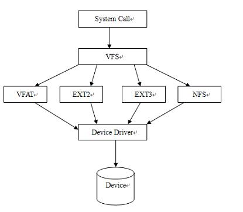
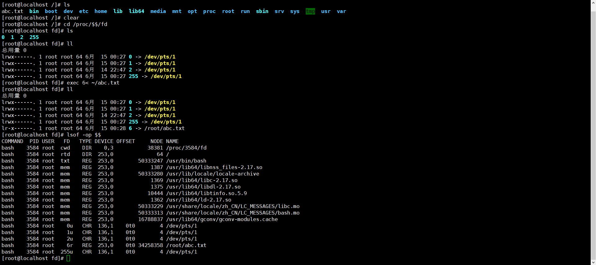
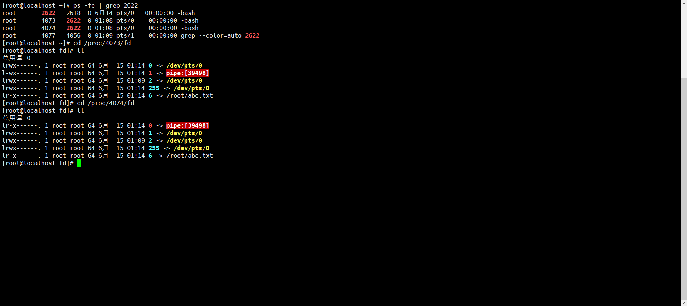
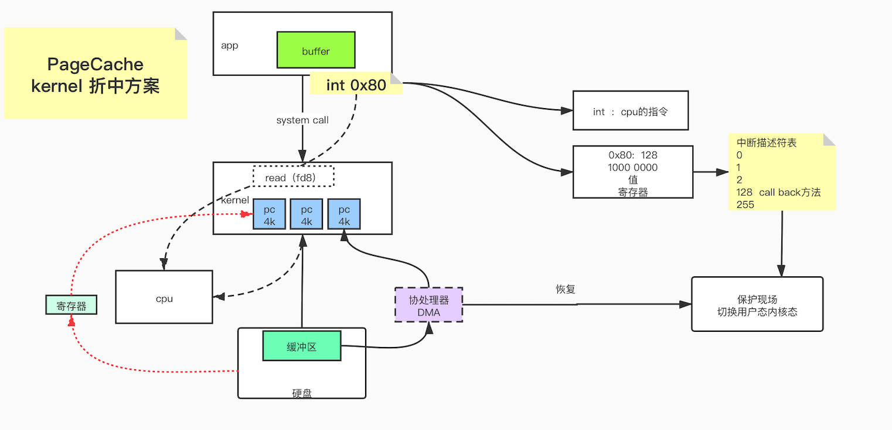
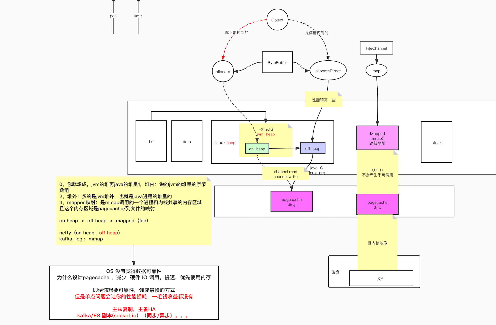

## 文件系统的IO

### 虚拟文件系统VFS

基本概述：VFS是 Linux 内核中的一个软件层，用于给用户空间的程序提供文件系统接口；同时，它也提供了内核中的一个 抽象功能，允许不同的文件系统共存。系统中所有的文件系统不但依赖 VFS 共存，而且也依靠 VFS 协同工作。

VFS借助它四个主要的数据结构即超级块、索引节点、目录项和文件对象以及一些辅助的数据结构，向Linux中不管是普通的文件还是目录、设备、套接字等 都提供同样的操作界面，如打开、读写、关闭等。只有当把控制权传给实际的文件系统时，实际的文件系统才会做出区分，对不同的文件类型执行不同的操作。由此 可见，正是有了VFS的存在，跨文件系统操作才能执行，Unix/Linux中的“一切皆是文件”的口号才能够得以实现。



案例：通过自己创建磁盘镜像文件，挂载到vfs目录中，进行目录文件操作

```bash
#这里如果inputfile 是/dev/zero，创建一个空的磁盘镜像，大小为100M
#如果if是磁盘，of是文件，就是备份
#如果if是文件，of是磁盘，就是恢复
#如果if是磁盘，of也是磁盘，就是对拷
dd if=/dev/zero of=~/disk02.img bs=1048576 count=100
#使用losetup将磁盘镜像文件虚拟成块设备
losetup /dev/loop0 ~/disk02.img
#对该文件格式化成ext2文件系统
mke2fs /dev/loop0
mkdir /mnt/loop
#挂载块设备
mount -t ext2 /dev/loop0 /mnt/loop
cd /mnt/loop
mkdir bin lib64
whereis bash
ldd /bin/bash
cp /bin/bash bin
cp /lib64/{libtinfo.so.5,libdl.so.2,libc.so.6,ld-linux-x86-64.so.2}  lib64
chroot ./
echo "aaa" > /abc.txt
exit
cat abc.txt
```

### 文件描述符FD

常用文件类型：socket，pipeline

```bash
#进到当前进程的文件描述符目录
cd /proc/$$/fd
#创建一个新的文件描述符
exec 6< ~/abc.txt
#查看当前进程中打开的文件，可以查看偏移量，此时偏移量为0
lsof -op $$
#从6文件中读取一行到a上，再看偏移量会发生变化
read a <& 6
lsof -op &&
```



#### 重定向机制：

任何程序都有0：标准输入，1：标准输出，2：异常输出

``` bash
ls ./ 1> ~/ls.out   修改ls的标准输出，原来是当前屏幕，现在是~/ls.out
read a 0< ls.out   修改read的标准输入

ls ./ /fdsfadf 1> ls01.out 2> ls02.out   修改标准输出1到ls01.out，异常输出2到ls02.out
ls ./ /fdsfadf 1> ls03.out 2> ls03.out   如果指向同一个文件，1输出会覆盖掉
```

read a 0< ls.out   修改read的标准输入

ls ./ /fdsfadf 1> ls01.out 2> ls02.out   修改标准输出1到ls01.out，异常输出2到ls02.out

ls ./ /fdsfadf 1> ls03.out 2> ls03.out   如果指向同一个文件，1输出会覆盖掉

重定向：如果希望将异常输出2指向标准输出1，再指定标准输出1

```bash
ls ./ /fdsfsdf 2> 1 1>ls04.out
```

这里有2个问题，1，重定向2> 1需要在中间加&, 2，这里2指向了1，1还没有指定，需要先指定1，然后再重定向2到1

```bash
ls ./ /fdsfsdf 1>ls04.out 2>& 1 
```

#### Pipeline

##### 父子进程

父子进程中的数据也是隔离的，父进程中的数据，子进程默认是不能访问的，需要由父进程export后，所有子进程才能访问

```bash
a=100
echo $a
#这里开启子进程，打印a的值是看不到的
/usr/bin/bash
echo $a
exit
#在父进程中export a这个值，再进子进程中打印，就可以看到了
export a
/usr/bin/bash
echo $a
```

##### 管道中的父子进程

```bash
a=1
# 管道左右两边的代码会在两个子进程中执行，执行完就退出了，所以父进程中的a在下一次打印时还是1
# 需要注意的是多条指令的代码块，{}符号和代码间必须加空格，代码必须以;结尾
{ a=9; echo "hello"; } | cat
echo $a
```

##### $$和$BASHPID

$$和$BASHPID都可以获得当前进程的pid，不同的是，在管道中，$$的优先级要高于管道，而$BASEPID则不会

```bash
echo $$
# 下面打印出的结果和上面的相同，管道中解释执行，在看到管道前，已经把$$替换成当前进程pid了，所以开始子进程后打印的也是当前进程的pid了
# 如果是$BASHPID，则是创建子进程后才进行替换，就能打印出子进程的pid了
echo $$ | cat
# 这里才可以打印子进程，证明管道中的左边的代码是在子进程中完成
echo $BASHPID | cat
```

##### 管道文件描述符

执行以下代码：

```bash
# 使用read指令阻塞，以便查看子进程
{ echo $BASHPID; read x; } | { cat; echo $BASHPID; read y; }
```


```bash
# 新开一个窗口，执行
ps -fe | grep 2622
#查看子进程4073，4074的文件描述符，可以看到左边进程的输出和右边进程的输入可以匹配
cd /proc/4073/fd
```



### PageCache

PageCache是内核的折中方案，由内核维护，是一个中间层，APP在启动的时候，并不会全量分配内存，也并不知道需要多少内存，随用随分配，由于进程在读取数据时，受IO影响较多，所以内核在读取数据时以4k为单位进行读取，称为PageCache。

#### 数据读取过程：

当App1处于running状态，执行过程中需要读取数据，这时就需要访问内核了，如果内核中的pageCache可以命中请求的数据，则直接返回，如果pageCache里没有，就会触发缺页中断，去磁盘里取，（内核也是一个程序，访问内核需要一个0x80中断，十进制中是128，二进制就是1000 0000，这个值是要放到CPU的寄存器中里，和内核里的中断向量表做匹配，这个表里可以理解为有0-255，这么多key，128这里有一个callback方法）此时会对App1保护现场，将App1置成挂起状态，CPU从用户态切到内核态，然后通过DMA从磁盘里将数据拷贝到pageCache中，再返回到App1，在数据拷贝完成后，也会触发一个中断程序，将App1恢复现场，置成running状态，此时App1数据已经取回，且处于running状态，CPU可以继续执行了




#### PageCache使用多大内存，是否延迟，是否会丢失数据

在Linux系统，可以查看dirty数据的配置

```bash
sysctl -a | grep dirty
```

```properties
vm.dirty_background_bytes = 0
vm.dirty_background_ratio = 10	// 这个参数指定了当文件系统缓存脏页数量达到系统内存百分之多少时（如10%）就会触发pdflush/flush/kdmflush等后台回写进程运行，将一定缓存的脏页异步地刷入外存
vm.dirty_bytes = 0
vm.dirty_expire_centisecs = 3000
vm.dirty_ratio = 30	// 这个参数则指定了当文件系统缓存脏页数量达到系统内存百分之多少时（如30%），系统不得不开始处理缓存脏页（因为此时脏页数量已经比较多，为了避免数据丢失需要将一定脏页刷入外存）；在此过程中很多应用进程可能会因为系统转而处理文件IO而阻塞。
vm.dirty_writeback_centisecs = 500
vm.dirtytime_expire_seconds = 43200
```

在一个程序访问文件的时候，只要内存够大，这个pageCache就会一直在内存中缓存，内存会尽量使用自己的可用空间，去缓存这个数据，当内存满了，会使用LRU算法清除数据，清除之前如果存在脏数据，则会写入磁盘后，再进行清除，这种情况应该不常见，通常在这之前，dirty数据已经满足了写入外存的条件。

#### 如何确定PageCache是否dirty

pageCache就是一个4096的字节空间，内存里会有一个索引指向它，可能理解为一个对象指向它，对象有属性dirty，inode

### MMAP

下面是一段代码，比较不同的IO处理方式，一种是普通的IO读写，一种是buffer IO读写，最后是

```java
public class OSFileIO {

    static byte[] data = "123456789\n".getBytes();
    static String path =  "/root/testfileio/out.txt";
    public static void main(String[] args) throws Exception {
        switch ( args[0]) {
            case "0" :
                testBasicFileIO();
                break;
            case "1":
                testBufferedFileIO();
                break;
            case "2" :
                testRandomAccessFileWrite();
            case "3":
//                whatByteBuffer();
            default:
        }
    }
    //最基本的file写
    public static  void testBasicFileIO() throws Exception {
        File file = new File(path);
        FileOutputStream out = new FileOutputStream(file);
        while(true){
            out.write(data);
        }
    }
    //测试buffer文件IO
    //  jvm  8kB   syscall  write(8KBbyte[])
    public static void testBufferedFileIO() throws Exception {
        File file = new File(path);
        BufferedOutputStream out = new BufferedOutputStream(new FileOutputStream(file));
        while(true){
            Thread.sleep(10);
            out.write(data);
        }
    }
    //测试文件NIO


    public static void testRandomAccessFileWrite() throws  Exception {
        RandomAccessFile raf = new RandomAccessFile(path, "rw");
        raf.write("hello mashibing\n".getBytes());
        raf.write("hello seanzhou\n".getBytes());
        System.out.println("write------------");
        System.in.read();
        raf.seek(4);	// 随机读写能力
        raf.write("ooxx".getBytes());
        System.out.println("seek---------");
        System.in.read();
        FileChannel rafchannel = raf.getChannel();
        //mmap  堆外和文件映射的   byte  not  object
        MappedByteBuffer map = rafchannel.map(FileChannel.MapMode.READ_WRITE, 0, 4096);
        map.put("@@@".getBytes());  //不是系统调用  但是数据会到达 内核的pagecache
            //曾经我们是需要out.write()  这样的系统调用，才能让程序的data 进入内核的pagecache
            //曾经必须有用户态内核态切换
            //mmap的内存映射，依然是内核的pagecache体系所约束的！！！
            //换言之，丢数据
            //你可以去github上找一些 其他C程序员写的jni扩展库，使用linux内核的Direct IO
            //直接IO是忽略linux的pagecache
            //是把pagecache  交给了程序自己开辟一个字节数组当作pagecache，动用代码逻辑来维护一致性/dirty。。。一系列复杂问题

        System.out.println("map--put--------");
        System.in.read();
//        map.force(); //  flush
        raf.seek(0);
        ByteBuffer buffer = ByteBuffer.allocate(8192);
//        ByteBuffer buffer = ByteBuffer.allocateDirect(1024);
        int read = rafchannel.read(buffer);   //buffer.put()
        System.out.println(buffer);
        buffer.flip();
        System.out.println(buffer);
        for (int i = 0; i < buffer.limit(); i++) {
            Thread.sleep(200);
            System.out.print(((char)buffer.get(i)));
        }
    }

    @Test
    public  void whatByteBuffer(){
//        ByteBuffer buffer = ByteBuffer.allocate(1024);
        ByteBuffer buffer = ByteBuffer.allocateDirect(1024);
        System.out.println("postition: " + buffer.position());
        System.out.println("limit: " +  buffer.limit());
        System.out.println("capacity: " + buffer.capacity());
        System.out.println("mark: " + buffer);

        buffer.put("123".getBytes());

        System.out.println("-------------put:123......");
        System.out.println("mark: " + buffer);

        buffer.flip();   //读写交替

        System.out.println("-------------flip......");
        System.out.println("mark: " + buffer);

        buffer.get();

        System.out.println("-------------get......");
        System.out.println("mark: " + buffer);

        buffer.compact();

        System.out.println("-------------compact......");
        System.out.println("mark: " + buffer);

        buffer.clear();

        System.out.println("-------------clear......");
        System.out.println("mark: " + buffer);
    }
}
```




## 内存和IO的关系

## 网络IO

####  BIO

Linux中的几个命令：

jps 查看当前java进程

lsof -p  查看java进程的文件描述符

netstat -natp	查看网络连接

tcpdump -nn -i eth0 port 9090	抓取网络连接的传输数据

strace -ff -o out java TestSoctet	可以获得当前进程的系统调用详细情况


关于BIO的简单理解：服务端启动一个阻塞式服务，等待客户端连接，在用户连接过后，服务端启动一个新的线程去处理这个连接。

1，服务端启动，但是没有代码没有accept的时候，这时已经可以看到有一个9090端口的监听了

2，客户端启动，这里已经可以看到有一个tcp连接了，但是并没有赋给当前进程，只是在内核里已经存在了，此时在数据传输界面已经可以看到三次握手数据了，这时客户端服务端都已经开辟资源为对方服务了

3，在客户端发送abc到服务端，数据传输界面已经可以看到传输的数据了，传输了几个字节，但是由于服务端没有 accept，所以接收不到

4，服务端走到accept代码，这时已经可以看到，tcp连接已经分配给当前java进程了，而且能接收到刚才客户端发送的abc。

具体的数据传输如下图：


任何App如果有对kernel的网络交互，都肯定会有三个步骤：

socket // 创建一个新的文件描述符fd3

bind(fd3, 9090) //绑定到端口9090上

linsen(fd3) // 监听这个文件描述符

然后才有accept或者read，这是一个线程阻塞操作(blocking)，在监听到有新的连接的时候，内核会clone一个新的进程去处理，调用内核resv接收数据，这里也是一个线程阻塞操作(blocking)，这些系统调用，可以通过strace查看。

BIO存在的问题：数据的多次拷贝，多次阻塞，连接数多的情况下，会创建过多的连接，系统消耗太大

#### NIO


## 参考资料

https://segmentfault.com/a/1190000020993686