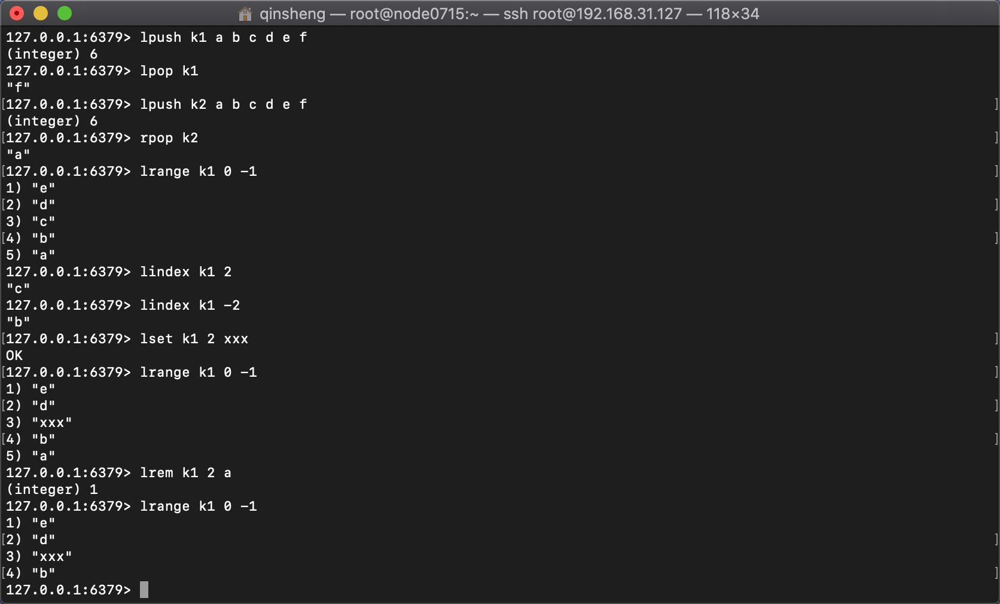

## Redis前置常识

磁盘，寻址速度，ms级别

内存，寻址速度，ns级别，速度是磁盘的10W倍

IO buffer，磁盘扇区512byte，如果一次读取数据过小，索引成本变高，如果一次读取数据过大，容易造成浪费，操作系统中，缓存行大小为4k。

数据库，索引都是存在于磁盘中，关系型数据库倾向于行级存储，在数据插入之时，已经给这行数据分配好空间，之后增删改只需要修改数据，不用移动其他数据了。在内存中存在B+T，查询数据时，先找出相应的4k的索引，再通过索引找到4k的数据。

数据库，表数据量很大，性能会不会下降？如果表有索引，增删改速度虽然会变慢，但是查询速度，如果是查询一条的话，速度依然不会变慢，如果并发大的情况下，会受硬盘带宽影响。

JVM一个线程的成本1MB，线程如果太多会造成内存成本过高，以及CPU调度成本过高。

## Redis的引入

由于内存的速度比磁盘快得多，纯内存数据库(SAP-NANA)价格异常昂贵，所以有了折中方案-缓存

2个基础设施的考虑

冯诺伊曼体系的硬件

以太网，TCP/IP的网络

## Memcached和Redis

同样作为key-value的缓存数据库，memcached的value没有类型的概念，以json来表示各种不同的数据结构

redis的value有数据类型的好处：

如果client需要取回v中的一个值，memcache需要返回所有的value到client，由client去解析，而在redis中，对每种数据类型有相应的方法，符合<b>计算向数据移动</b>


# Redis

## 安装

```bash
# 下载redis
yum install wget -y
mkdir soft
cd soft
wget http://download.redis.io/releases/redis-5.0.5.tar.gz
tar xf redis-5.0.5.tar.gz
cd redis-5.0.5
# 安装redis
yum install gcc -y   # 安装编译环境，make命令需要
make distclean	# 如果安装gcc之前执行了make，需要执行此命令删除一些临时文件
make	# Linux操作系统自带的编译命令，相同于javac，但是不是针对一种语言，用Makefile去做编译，Makefile由厂商提供
cd src  # 此时src目录下，已经有可执行程序了，redis-cli, redis-server，可以./redis-server启动，显然这种不是我们期望的启动方式
cd ..
make install PREFIX=/opt/qinsheng/redis5 # install执行安装，将可执行文件迁移到指定目录，和源码不用放在一起了，但是还是需要通过./redis-server启动，如果希望用  service redis start启动，需要继续如下操作
cd ~/soft/redis-5.0.5/utils # 运行install_server.sh之前，需要设置redis_home和添加path
vi /etc/profile # 在最后加上以下内容
	export REDIS_HOME=/opt/qinsheng/redis5
	export PATH=$PATH:$REDIS_HOME/bin
source /etc/profile	# 使profile文件生效， 这样在任何地方都可以执行redis-cli命令了
./install_server.sh	# 一个物理机上可以多次执行，生成多个redis进程，使用不同的端口区分
	# 可执行文件就一份在目录，但是内存中未来的多个实例需要各自的配置文件，持久化目录等资源
	# 现在在/etc/init.d/下，有redis_6379脚本，并且是绿色可执行，可以用service redis_6379 start/stop/status进行操作了
ps -fe | grep redis
```


## 远程连接

环境：Mac一台，Windows10一台，IP地址为192.168.31.127，虚拟机Linux CentOS6安装在Windows10中，IP为192.168.169.15

从Mac中连接虚拟机中的Redis服务，需要进行如下操作：

1，关闭Windows及虚拟机防火墙。

2，在VMWare中，对NAT网络服务端口进行映射，redis服务端口为6379，需要增加映射：6379 - 192.168.169.15：6379

3，更改Redis.conf文件，将bind 127.0.0.1注释，并将protected-mode设置为no。这里需要注意的是，修改配置文件并不能使已经创建好的server生效，如果已经创建了redis_6379，即使重启也不会生效，需要删除server脚本，重新生成。

在完成以上步骤后，Mac中可以通过访问redis-cli -h 192.168.31.127 -p 6379进行访问。

## 概念

Redis是单进程，单线程，单实例，使用epoll来高效处理高并发的请求，同时由于redis是单线程的，可以保证每个连接内的命令是有顺序的。Redis是单进程，但可以启动多个Redis进程，每个Redis中默认有16个库，可以进行配置，每个库中存储的是key-value，Redis的value有五个数据类型，且对每种类型都有各自不同的方法，如果用非string的方法访问string，直接type判断时就会报错。

### 二进制安全

在 Redis 中，如果存一个 `中`字，由于客户端编码不同，可能占 3 个字节，也可能占两个字节。存一个 `10` 占用 2 个字节，存 `100` 要占 3 个字节。这是因为 Redis 用了二进制安全的技术，不将数据进行任何转换，以二进制的方式来什么存什么。为此，同一个 Redis 服务的客户端要统一编码格式，不然数据的读和存会有不一致的问题。

### 正反向索引

```md
 0  1  2  3  4
 h  e  l  l  o
-5 -4 -3 -2 -1
```

### 字符集

标准的叫ASCII字符集，其他的都叫做扩展字符集，其他的字符集不会再对ASCII进行重编码，0xxxxxxx。

如果第一个位是0，就不用考虑是不是其他字符集了，直接就是ASCII码

如果第一个位不是0，如果是UTF-8，不是0开头，是3个1和1个0，那么这上字符就是3个字节的，除了当前字节，还需要再读取两个字节，去掉前面的3个1和1个0，再进行显示。

## 五大数据类型

### String

对于五大数据类型中最常用的String类型，又可以分为三种，分别是字符串，数值，bitmap

#### 字符串

```bash
# 基本命令
set k1 hello
get k1
append k1 " world"
getrange k1 6 10	# 数值是k1的偏移量，取第6到第10位
setrange k1 6 redis	# 从第6位开始，后面的替换成redis
strlen k1
type k1 -> string	# 取得数据类型

mset k2 bbb k3 ccc # 同时设置2组key-value
mget k2 k3
set k1 aaa nx # 如果k1已经存在，不会更新k1的值，如果不存在，添加k1-aaa键值对
set k5 bbb xx # 如果k5已经存在，更新k5的值，如果不存在，不会添加
mset k1 aaa k2 bbb nx # 原子操作
getset k1 abc # 返回k1的值，并重新设值
```

#### 数值

```bash
# 数值基本命令
set k1 99	# k1=99
incr k1	# k1=100
incrby k1 25 # k1=125
decr k1 # k1=124
decrby k1 25 # k1=99
incrbyfloat 0.5 # k1=99.5

# 关于redis的存储，是二进制安全的
set k2 9
strlen k2 -> 1
append k2 999 # k2=9999
strlen k2 -> 4

set k3 中 # utf-8
strlen k3 -> 3
set k4 中 # gbk
strlen k4 -> 2

redis-cli --raw # utf-8
get k3 -> 中
get k4 -> 乱码	# redis的存储和读取需要统一编码
```

#### bitmap

```bash
#	  0号字节   1号字节	偏移量以位进行计算
#	   	0					1
#  00000000	00000000
setbit k1 1 1 # 01000000
get k1 # 返回@
setbit k1 7 1 # 01000001
get k1 # 返回A
strlen k1 # 1，只有一个字节
setbit k1 9 1 # 01000001 01000000
get k1 # 返回A@
strlen k1 # 2，现在有两个字节了

bitcount k1 0 -1 # 3，0到-1的字节里有3个1
bitpos k1 1 1 1 # 9，第1到第1个字节中，其实就是第1个字节，第一个1的偏移量，01000001 01000000，就是最后一个1，偏移量9

# bitop 对于二进制的运算
setbit k1 1 1 # 01000000
setbit k1 7 1 # 01000001
setbit k2 1 1 # 01000000
setbit k2 6 1 # 01000010
bitop add addkey k1 k2 # k1 k2进行与运算，结果就是01000000，
get addkey # 返回@
```

##### 应用场景 - 位图

统计用户登录天数，且窗口随机

```bash
setbit sean 1 1	# 第2天登录
setbit sean 7 1 # 第8天登录
setbit sean 364 1	# 第365登录
strlen sean
bitcount sean -2 -1 # 计算sean最后16天的登录次数
```

618做活动送礼物，计算需要备多少货

```bash
setbit 20200101 1 1	# 2020年1月1号，1号位代表的用户登录了
setbit 20200102 1 1 # 2020年1月2号，1号位代表的用户登录了
setbit 20200102 7 1 # 2020年1月2号，7号位代表的用户登录了
bitop or orkey 20190101 20190102	# 给这两天做或运算，就能计算出两天登录的人的数量，01000001
bitcount orkey 0 -1	# 计算有几人登录，返回2.
```

### List

Redis中的链表操作，分为左右，可以通过不同的排列组合，模拟出不同数据结构

```bash
# List基本命令
# 同向命令，先进后出，栈
lpush k1 a b c d e f  # 从左边插入，这在内存里应该是 f e d c b a
lpop k1	# 从左边取出，返回f
# 反向命令，先进先出，队列
lpush k2 a b c d e f 
rpop k2 # 从右边取出，返回a
# 数组操作
lrange k1 0 -1 # 取回从0到-1，即所有的元素
lindex k1 2 # 返回第3个元素
lindex k1 -2 # 返回倒数第2个元素
lset k1 2 xxx # 将k1第3个元素更新为xxx
lrem k1 2 a # 移除前2个a
lrem k1 -2 a # 移除后2个a
linsert k1 before/after c g # c代表k1中的元素， g代表插入的元素，在k1的c前面/后面插入g，这里的c是第一个c元素
llen k1 # 元素长度
# 阻塞，单播队列
blpop xxx 0 # Client1：0代表阻塞，如果是数值则是设置时间，此时窗口会一直阻塞，直到有另外的redis进程，给xxx赋值
blpop xxx 0 # Clinet2：同Client1，测试是否FIFO
rpush xxx hello # Client3，给xxx赋值，此时Client1获得xxx的值，退出，Client2继续阻塞
rpush xxx world # Client3，给xxx赋值，此时Client2获得xxx的值，退出
# 删除元素命令
ltrim k1 0 -1 # 一个不会删除
ltrim k1 2 -2 # 删除0，1，-1三个元素
```




### Hash

Redis是键值对的数据类型，这里的值是hash类型，即值也是键值对，如果需要保存一个用户的信息，用String来保存可能是以下命令，过于复杂和成本过高，从而引入了hash类型。

```bash
set sean::name 'zhangsan'
set sean::age '18'
set sean::address 'shanghai'
# 在取值时，需要先取得sean的属性集合，再通过属性集合取得属性值
keys sean*	# 通过sean*模糊匹配的成本高
mget key...	# 需要多一次查询
```

```bash
# hash基本命令
hset sean name 'zhangsan'
hset sean age '18'
hset sean address 'shanghai'
hmset sean name 'zhangsan' age '18' address 'shanghai' # 一个命令给三个属性赋值，和String的mset一样
# 取值
hkeys sean	# 取所有的键
hvals sean	# 取所有的值
hgetall sean	# 取所有的键值
# 计算	应用场景-商品详情页，微博中的点赞数，收藏数，等等
hincrbyfloat sean age 0.5	# 增加年龄0.5岁，hash没有decr方法，如需要减，加上负值即可
hincrbyfloat sean age -1
```


### Set

#### 无序&去重

```bash
# set基本命令
sadd k1 aa bb aa ee ff kk ll ii	# set会去重保存
smembers k1 # 取得k1所有元素，这命令不般不使用，会占用较大带宽，影响redis的吞吐量
```

#### 交集，并集，差集

```bash
# set的重要命令，取两个集合交集，并集，差集
sadd k2 1 2 3 4 5
sadd k3 4 5 6 7 8
sinter k2 k3 # 返回交集4，5
sinterstore destkey k2 k3 # 将k2,k3的交集结果保存在服务端，key为destkey，值是4，5
sunion k2 k3 # 返回并集1，2，3，4，5，6，7，8
sunionstore unionkey k2 k3 # 同理，将k2,k3的并集保存在服务端
sdiff k2 k3 # 返回1，2，3 差集跟顺序有关
sdiff k3 k2 # 返回6，7，8
```


#### 随机事件

##### 应用场景 - 抽奖

```bash
# set的另一个重要命令，随机事件，
# srandmember key count，
# count如果是正数，取出一个去重的结果集，不会超过已有集
# count如果是负数，取出一个带重复的结果集，一定满足要求的数量，随机补上集合里元素
# count如果是0，不返回
sadd users user1 user2 user3 user4 user5 user6 user7 # 增加七位用户
srandmember users 5 # 随机5位，不会重复
srandmember users 10 # 7位无序取出
srandmember users -5 # 随机5位，可能重复
srandmember users -10 # 随机10位，可能有某一些元素没有出现

# spop命令，随机取出一个，并从集合中移除，这个更符合年会抽奖
spop users # 随机弹出一个，集合长度变为6
scard users # 集合长度，返回6
```


### Sorted-Set

#### 有序&去重

因为Sorted-Set是有序集合，所有在插入时，都必须有一个权重，用来进行排序的一个标准。

```bash
# sorted-set基础命令
zadd k1 8 apple 2 blanana 3 orange	# 插入3种水果，分别给出权重数值
zrange k1 0 -1	# 取出k1的元素，返回blanana orange apple，按权重从小到大
zrangebyscore k1 3 8 withscores	# 取出权重在3-8之间的
zrange k1 0 1	# 取出第1到第2个元素 
zrevrange k1 0 1	# 从大到小排序，取出第1到第2个元素
zrange k1 -1 -2	# 取不到值
zrange k1 -2 -1 # 从小到大排序，取出倒数第2到倒数第1个元素
```

#### 更新权重重新排序

##### 应用场景 - 歌曲排序榜

```bash
zincrby k1 2.5 blanana # 给blanana加权重2.5，这样集合顺序也会发生变化，变成orange blanana apple
```

在歌曲排序榜中，有很多人去更新数据，由于redis的单线程，不用担心事务的处理，在更新权重过程中，速度远高于关系型数据库。


#### 交集，并集，差集

Sorted-Set也是Set，只不过是排序集合，所有同样也有交集，并集，差集，比普通Set复杂的是，在做交集过程中，权重如何计算，Redis中，多个集合都有的元素在做交集时，权重可以按比计算，同时可以取Sum，Max或Min。

```bash
# sorted-set的重要命令，取两个集合交集，并集，差集，并计算权重
# 增加两个有序集合
zadd k1 80 tom 60 sean 70 baby
zadd k2 60 tom 100 sean 40 ethan
# 取两个有序集合的交集
# 下面这条命令：取k1,k2的交集，保存在unkey中，k1的权重按1计算，k2的权重按0.5计算，最后按较大的权重进行排序
# 最后得到的结果是 
# ethan 20, 只在k2集合里有，且按0.5计算权重
# sean 60, k1,k2中都有，k1权重60，k2权重100按0.5算，取最大值是60
# baby 70, 只在k1中有，按1计算
# tom 80, k1,k2中都有，k1权重80，k2权重60按0.5算，取最大值是80
zunionstore unkey 2 k1 k2 weights 1 0.5 aggregate max 
```


#### 跳跃表 - Skiplist

在更新了权重值，或是集合的交并差运算后，如何能再次进行快速排序，如何实现的

这里引入了跳跃表的概念，

粗率解释：原本有一个集合3，7，22，45，在集合的上方增加了一层集合，3，22，45，再上一层是3然后指向了nil，如果需要插入11，则11去和3进行比较，比3大，然后再往下和3指向的元素进行比较，这里比22小，再往下和22左边的元素进行比较，比7大，然后进行指针修正，22左边的指针由7改成11，7右边的指针由22改成11，11的前后指针分别指向7，22。

在11插入后，会随机对11进行造成，可能是1也可能是3，图中所示就是造3层，会从左边元素进行查找，7只有一层，继续找到3，在2层中将3右边的指针从22改成11，同时将11的前后指针指向3和22，以此类推。

经过测试，增删改查综合下来，跳跃表这种数据结构相对最优


## Redis进阶

### 管道

Redis是一种基于客户端-服务端模型以及请求/响应协议的TCP服务。

这意味着通常情况下一个请求会遵循以下步骤：

- 客户端向服务端发送一个查询请求，并监听Socket返回，通常是以阻塞模式，等待服务端响应。
- 服务端处理命令，并将结果返回给客户端。

一次向redis服务器发送多个命令，减少连接，使通信成本降低

```bash
echo -e "set k2 99\nincr k2\nget k2" | nc localhost 6379	# 同时向服务端发送三条命令，由换行符\n分开
```

**重要说明**:  使用管道发送命令时，服务器将被迫回复一个队列答复，占用很多内存。所以，如果你需要发送大量的命令，最好是把他们按照合理数量分批次的处理，例如10K的命令，读回复，然后再发送另一个10k的命令，等等。这样速度几乎是相同的，但是在回复这10k命令队列需要非常大量的内存用来组织返回数据内容。

### 发布/订阅

用于发布/订阅消息

```bash
# Client1
publish redis hello	# 发布message到redis这个channel
# Client2
subscribe redis # 从redis这个channel中获取message，只有在订阅过后，监听状态下才能接收到C1发布的消息，监听前的消息不会获取。
```

#### 应用场景 - 聊天室

聊天室中一个客户端发送消息，其他客户端应该都能收到，这里涉及到历史消息的问题，一般聊天室中，不仅能看到实时聊天内容，还可以查看历史消息。

这里将消息分为三种，第一种实时消息，用发布/订阅就可以解决问题。

第二种是三天内的消息，这个消息可以保存在sorted-set中，以时间为score，消息为value进行保存，可以按时间进行排序，这样redis缓存可以解决数据的读请求。

第三种是三天以前的消息，全量数据保存在数据库中。


### 事务

Redis作为缓存数据库，特点是快，所以对事务的支持并不是很复杂。

```bash
# 事务基本命令
multi	# 开启事务
set k1 99
set k2 199
exec	# 提交事务

# 多客户端的事务对同一个key的操作，这里需要看谁先提交，谁后提交，由于Redis是单线程，所以事务的处理比较简单
# Client1					# Client2
multi							multi
get k1						delete k1
exec							exec

# watch 命令，在开启事务前，先watch某一个key，如果在事务提交时发现key值已经发生改变，则不执行事务里的操作
# Client1
watch k1
multi
get k1
keys *
exec	# 在Client1提交事务里的操作前，Client2更新了k1的值，此时Client1不会再执行事务里的操作
# Client2
set k2 updated

# discard 命令 当执行 DISCARD 命令时， 事务会被放弃， 事务队列会被清空， 并且客户端会从事务状态中退出
set foo 1
multi
incr foo
discard	# 放弃事务
get foo # 还是会返回1，incr foo命令没有被执行

```


### 布隆过滤器

布隆过滤器，简单说，防止用户请求数据库中不存在的数据，而造成数据库不必要的压力

#### 工作流程

1，需要将数据库里有的元素，通过某几种映射，分别对应到bitmap中，在bitmap中做标记

2，客户端向Redis请求数据，通过映射函数，通过在bitmap中是否有标记来判断数据库中是否有此元素

布隆过滤器是概率解决问题，会大量减少放行（缓存穿透），不可能百分百阻挡，但是成本低，可以大大降低数据库压力。

如果穿透了，数据库中不存在，那么Client应该增加redis中的key，value标记，同时如果数据库中存在，那么需要完成元素对bloom的添加。

#### 安装

```bash
# 访问redis.io modules，访问RedisBloom的github
wget https://github.com/RedisBloom/RedisBloom/archive/master.zip
yum install unzip	# 安装解压工具
unzip master.zip
make # 生成redisbloom.so文件
cp redisbloom.so /opt/qinsheng/redis5/	# redisbloom.so理论上放在任何地方都行，这里拷贝到redis目录下
redis-server --loadmodule /opt/qinsheng/redis5/redisbloom.so
redis-cli	# 可以使用bloom命令
```

#### 基本命令

```bash
 bf.add bf abc	# 加入元素
 bf.exist bf abc	# 返回1，此元素存在
 bf.exist bf aaa	# 返回0，此元素不存在
```


## 缓存/数据库

Redis作为数据库/缓存的区别，缓存的数据不是全量数据，缓存会随着访问变化更新数据，保证缓存中的都是热数据，因为内存大小是有限的。

因为内存大小是有限的，那么就需要根据业务的不同来内存大小的设置，key的过期时间及缓存的淘汰算法。


### 缓存有效期

```bash
# 有效时间的基本命令
set k1 aaa ex 20 # 20秒过期
ttl k1 # 查看剩余有效时间
get k1 # get命令不会延长有效时间
set k1 bbb # set命令会清空有效时间
expire k1 50 # 对已经存在的key设置有效时间
expireat k1 # 设置某元素的过期时间点
```

#### 过期判定原理

Redis keys过期有两种方式：被动和主动方式

被动：在用户访问时被发现过期

主动：有些过期的keys，永远不会访问他们。 无论如何，这些keys应该过期，所以定时随机测试设置keys的过期时间。所有这些过期的keys将会从密钥空间删除。

具体就是Redis每秒10次做的事情：

1. 测试随机的20个keys进行相关过期检测。
2. 删除所有已经过期的keys。
3. 如果有多于25%的keys过期，重复步奏1.

这是一个平凡的概率算法，基本上的假设是，我们的样本是这个密钥控件，并且我们不断重复过期检测，直到过期的keys的百分百低于25%,这意味着，在任何给定的时刻，最多会清除1/4的过期keys。

### 缓存淘汰算法

Redis的内存大小是由redis.conf文件中maxmemory-policy配置指令来进行配置，当内存满了的时候，会根据指定算法来进行内存回收。主要有以下几种算法

**noeviction**:  返回错误当内存限制达到并且客户端尝试执行会让更多内存被使用的命令（大部分的写入指令，但DEL和几个例外），这是不符合缓存的思想的，数据库则必须这样。

**allkeys-lru**:  尝试回收最少使用的键（LRU），使得新添加的数据有空间存放。

**volatile-lru**:  尝试回收最少使用的键（LRU），但仅限于在过期集合的键,使得新添加的数据有空间存放。

**lfu**: 尝试回收使用次数最少的键。

**allkeys-random**:  回收随机的键使得新添加的数据有空间存放。（过于不严谨，一般不会选用）

**volatile-random**:  回收随机的键使得新添加的数据有空间存放，但仅限于在过期集合的键。（同上，一般不会选用）

**volatile-ttl**:  回收在过期集合的键，并且优先回收存活时间（TTL）较短的键，使得新添加的数据有空间存放。（需要进行计算，成本过高）


