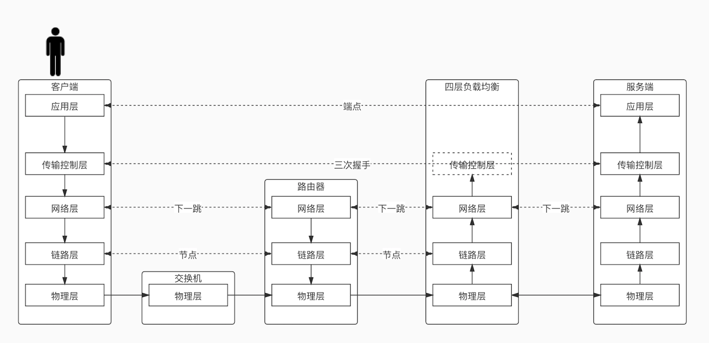
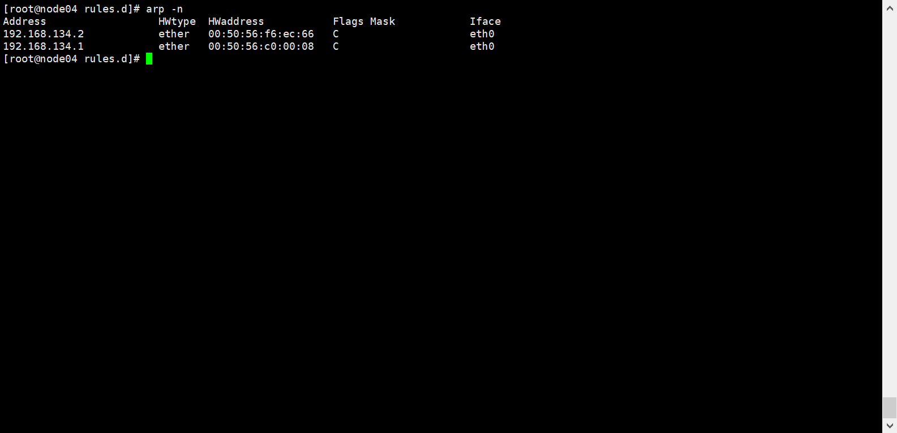
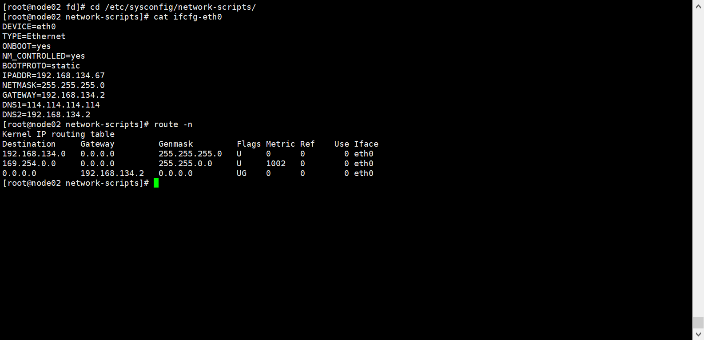
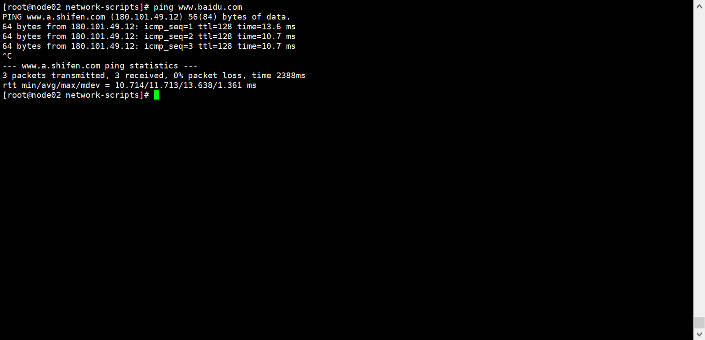
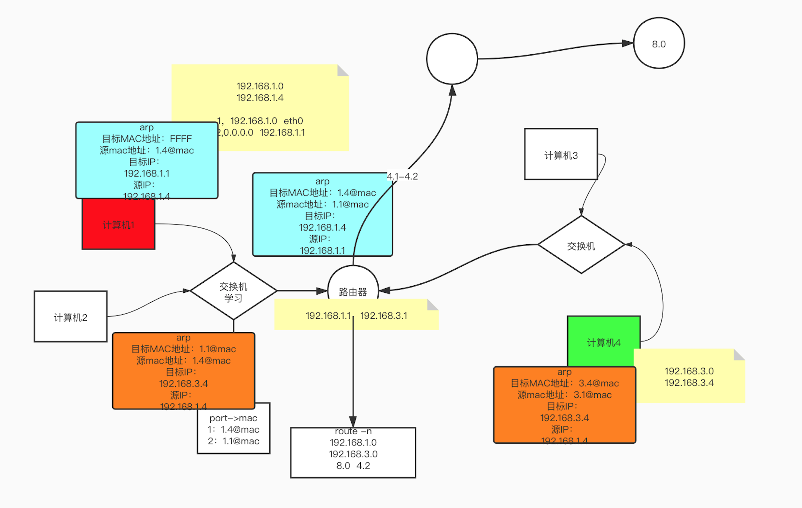
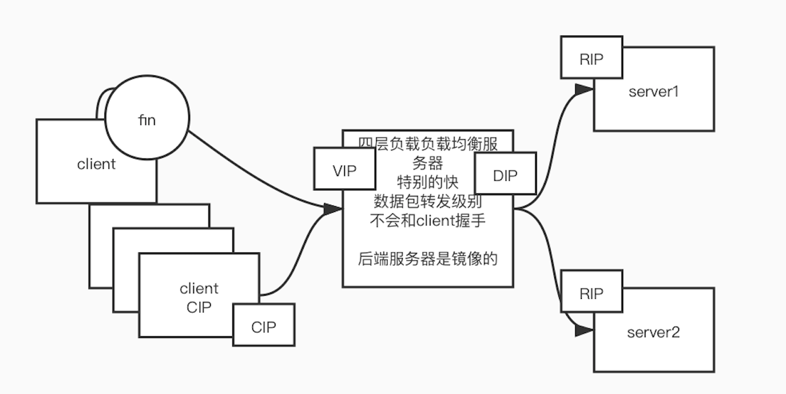
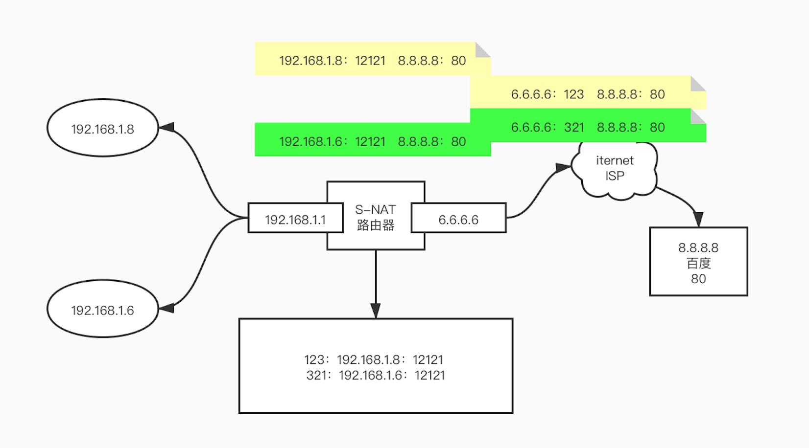
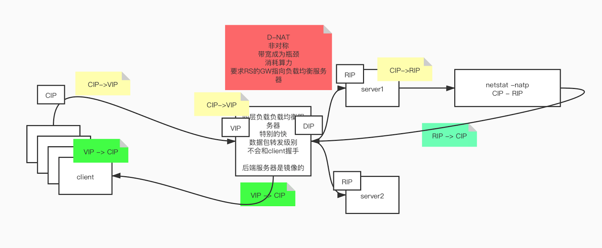
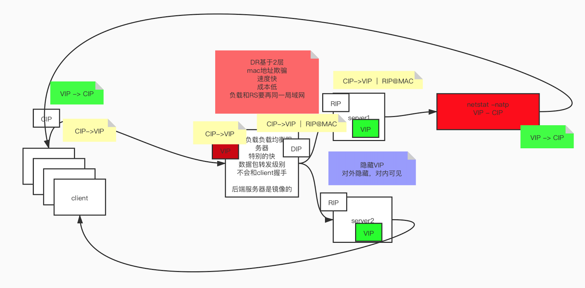
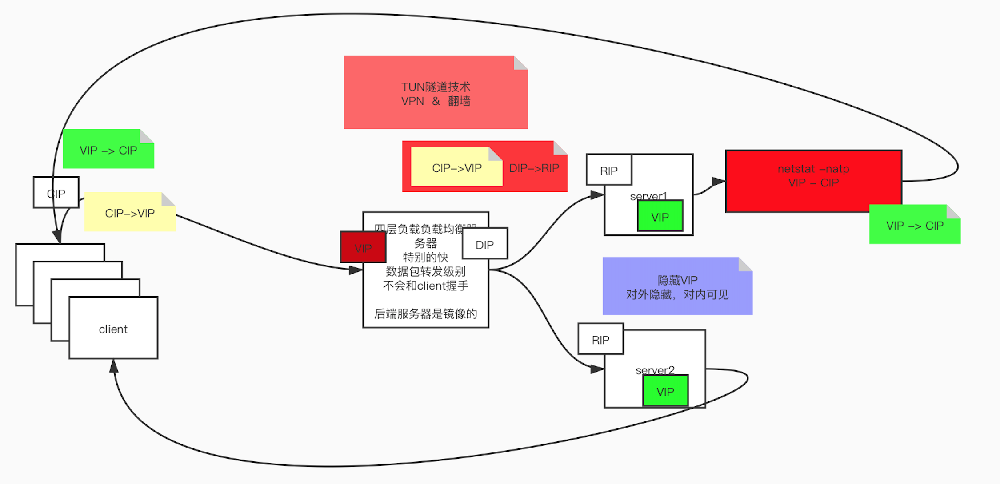

## 网络协议原理

### 七层协议

#### 七层协议的工作图



#### 应用层

HTTP协议，SSH协议

#### 传输控制层

TCP协议，TCP协议是面向连接的可靠的传输协议

在三次握手后，内核级开辟资源，开始传输数据，一直到四次分手，这里是一个最小粒度，不可被分割。

在每一次的请求过程中，都有一段阻塞，例如发送握手请求包，发送完，线程就进入阻塞状态，等待数据经过网络层，链路层，物理层到达服务器，再返回回来，线程继续。

##### 三次握手


##### 四次分手

假设由客户端发出断开请求（如果是服务端先发出断开请求就是反过来）

1，C发出断开请求，C-----FIN----->S，此时S端就会进行 CLOSE_WAIT状态。

2，S响应C断开请求，S-----FIN，ACK----->C

此时，如果S端不发送断开请求了，那么C端就会进入FIN_WAIT2状态

如果S端接着也发出断开请求

3，S发出断开请求，S------FIN------>C

4，C端响应断开请求，C------ACK--------S

此时，S端收到C端发出的响应后，会变成CLOSED状态，销毁资源，但是C端并不知道第4次的数据S端是否收到，所以C会进入一个TIME_WAITE状态，在这个状态下，是会消耗Socket资源的，相同的端口不能使用这个资源建立新的连接。

*这里也是可以通过系统配置，systctl -a | grep reuse， 设置成为1，可以快速重复使用

#### 网络层

网络层主要是为了找到下一跳的地址

#### 链路层

链路层会根据链路表，查看到IP地址和网卡硬件地址的一个关系，找到下一跳的MAC地址，并将源MAC地址和目标MAC地址封装在数据包最外层。



#### 物理层

物理层处于最低，为整个开放系统的基础，为设备之间的数据通信提供传输媒体及互连设备，为数据传输提供可靠环境。

### 网卡信息，路由表信息

#### 网络层的四个维度：

如下图所示，当前机器的网络信息：

``` bash
// 本机网络信息
IPADDR=192.168.134.67	// IP地址
NETMASK=255.255.255.0	// 子网掩码
GATEWAY=192.168.134.2	// 网关
DNS1=114.114.114.114	// DNS服务器
//	IP地址与掩码做按位与运算，得到结果192.168.134.0，为网络号，66为主机号
// 路由表
192.168.134.0		0.0.0.0					255.255.255.0		eth0
0.0.0.0					192.168.134.2		0.0.0.0					eth0
```



#### 下一跳机制

以访问百度为例：百度的IP地址180.101.49.12为例

会将目标地址与当前路由表中的子网掩码做与运算，找到匹配的网关地址，这里最后一条才满足，就是默认网关192.168.134.2，再通过ARP表，得到默认网关的网卡硬件地址



#### 图解一次完整的网络传输



##### 路由器的学习过程

在了解数据传输之前，先了解下路由器及交换机的学习过程以及计算机中ARP表的生成过程，当一台计算机1的网卡激活的时候，他会封装一个数据包，包括源IP地址192.168.1.4，源mac地址1.4@mac，目标IP即默认网关192.168.1.1，目标mac地址：FFFF(此时计算机1并不知道默认网关的mac地址)

当交换机接收到目标地址为FFFFFF的请求，会将ARP包转发出去，当局域网里的其他计算机接收到数据包，发现IP地址不是自己，会丢弃这个数据包，当路由器接收到这个数据包，发现IP地址是自己，会返回一个数据包，目标地址即是收到的数据包里的源地址192.168.1.4，目标mac地址即是1.4@mac，源IP地址是192.168.1.1，源mac地址即1.1@mac，返回的数据包经过交换机的时候，交换机也是学习过计算机1和IP地址192.168.1.4的关系了，不需要再经过广播了，直接返回给计算机1，这时计算机1的arp表里，就已经存在了默认网关192.168.1.1和1.1@mac的对应关系了。

##### 数据包传输流程

假如需要从计算机1（IP：192.168.1.4），访问计算机4（IP：192.168.3.4）

由于不在局域网里，会通过路由表，ARP表，查找到默认网关以及默认网关的MAC地址，封装一个数据包（源IP192.168.1.4，目标IP192.168.3.4，目标Port，源MAC地址1.4@MAC，目标MAC地址1.1@MAC，这里的mac地址还是默认网关的mac地址。

在路由器的路由表中，存在对应关系

192.168.1.0	192.168.3.0	// 通过这条会找到计算机4的默认网关，从而实现数据传输

经过路由器，找到主机1.4的MAC地址，重新封装数据包，更换下一跳的MAC地址，新的数据包（源IP地址192.168.1.4，目标IP192.168.3.4，源MAC地址3.1@MAC，目标MAC地址3.4@MAC）

返回时再走一遍相同的流程，完成一次数据传输。


## 负载均衡

当一台服务器不能满足过多的客户端访问时，需要采用多台服务器来公共响应客户端请求，然而根据网络协议原理中的知识，每个服务端的IP地址都不同，这时需要一台负载均衡服务器来分发客户请求，如下图所示：

### 为什么服务端不能满足的客户端请求，负载均衡服务器可以：

服务器端是应用层，如果是Tomcat，因为JAVA程序，需要运行在JVM中，再调用内核的网络服务，会更慢。

负载均衡服务器是基于四层协议的，不会和客户端进行连接，只是负责转发，后台的服务器需要是镜像的。

tips：Nginx的反向代理，会根据用户的请求路径，来向不同的服务器进行转发，因为涉及到业务，所以会和客户端建立三次握手，是基于七层协议的负载均衡，负载是有上限的，在高流量的请求下，需要四层负载均衡服务器+Nginx七层负载均衡服务器再转发到服务器进行业务处理。

### 四层负载技术

#### NAT - Network Address

##### 路由器的另外一张表

假如同一局域网中的两台计算机1.8和1.6需要同时访问百度8.8.8.8:80，在经过路由器时，会将私网地址转为公网地址6.6.6.6，假如1.8和1.6两台计算机分配到了相同的端口，会导致返回数据经过路由器时，分不清是1.6机器还是1.8机器的。

路由器会再建一张表，来做一个对应关系，如下图：将1.8机器的地址对应到端口123，1.6机器的地址对应到321，在返回时就可以通过这张表找到正确的机器。



##### NAT模式的负载均衡服务器工作流程图

CIP：Client  IP（客户端），VIP：Virtual IP（负载均衡服务器），RIP：Real IP（实际处理业务的服务端）

客户端是不知道有RIP存在的，客户端的请求是CIP-VIP，在经过负载均衡服务器时，会将VIP转为真实的RIP地址（同理上面路由器的另外一张表），封装数据包CIP-RIP到达Server1，处理完请求后会封装RIP-CIP的数据包，经过负载均衡服务器，负载均衡服务器需要再将RIP换成VIP，否则数据返回到客户端会被丢弃，不是同一个Socket



##### NVT模式的两个缺点：

1，两次封装数据包带来的算力消耗。

2，请求和返回是相同的通道，通常情况下请求的数据包会很小，返回的数据包会很大，导致带宽瓶颈

#### DR - Direct Routing

##### DR模式的负载均衡服务器工作流程图

DR是基到2层链路层做的一次mac地址欺骗

当负载均衡服务器接收到请求CIP-VIP时，将数据包重新封装一层，增加Server1的MAC地址，即CIP-VIP|RIP@MAC地址分发到Server1，

（Server1需要添加一个隐藏的VIP地址，在自己的内核空间，这个地址不会对外暴露）

Server1接收到数据CIP-VIP|RIP@MAC时，发现MAC地址是自己的，撕开MAC地址，VIP也是内核里配的，进行处理，处理完后，会封装一个VIP-CIP的数据包返回，返回的数据包可以走其他网络直接到达客户端，不需要再经过负载均衡服务器。



##### DR模式的缺点：

负载均衡服务器需要和Server处于同一局域网中，MAC地址是基于局域网的。

#### TUN隧道技术

给CIP-VIP的数据包里，套一层DIP-RIP的数据包再发送到Server，Server中会建立一个VIP-CIP的连接，可以直接把数据返回给Client。



### DR模式实验

目前企业中用得最多的就是DR模式负载均衡

在DR模式中，服务端Server里需要配置隐藏的VIP，且此IP地址只能处于内核中，对内可见，对外隐藏。

```markdown
隐藏VIP方法：对外隐藏，对内可见 ：

内核参数 Kernel Parameter:
目标mac地址为全F，交换机触发广播
 /proc/sys/net/ipv4/conf/*IF*/
arp_ignore: 定义接收到ARP请求时的响应级别；
 0：只要本地配置的有相应地址，就给予响应；
 1：仅在请求的目标(MAC)地址配置请求
    到达的接口上的时候，才给予响应；

arp_announce：定义将自己地址向外通告时的通告级别；
 0：将本地任何接口上的任何地址向外通告；
 1：试图仅向目标网络通告与其网络匹配的地址；
 2：仅向与本地接口上地址匹配的网络进行通告；
```

#### 详细步骤

##### 准备三台虚拟机：

node02: 192.168.134.67	负载均衡服务器，负责将接收到的请求转发给服务器

node03: 192.168.134.68	业务处理服务器

node04: 192.168.134.69	业务处理服务器

##### 修改内核：

在node03, node04中配置的虚拟网络，不能向外通告，也不能响应请求，修改内核的响应，通告级别

##### 设置虚拟网络：

给node01 设置虚拟网络192.168.134.100，掩码255.255.255.0，用来接收客户端请求

给node02-03 设置虚拟网络192.168.134.100，掩码255.255.255.255，这里需要精准匹配，如果掩码也是255.255.255.0，会导致发送出去的数据，根据掩码与运算及就近原则（内核虚拟网卡近于物理网卡），数据发送不出去。

##### LVS服务配置

由于Linux系统集成了LVS技术，叫IPVS，同时提供了系统接口ipvsadm，可以直接通过ipvsadm命令进行操作：

##### 验证：

```markdown
node01:
	ifconfig  eth0:8 192.168.134.100/24
node02~node03:
	1)修改内核：
		echo 1  >  /proc/sys/net/ipv4/conf/eth0/arp_ignore 
		echo 1  >  /proc/sys/net/ipv4/conf/all/arp_ignore 
		echo 2 > /proc/sys/net/ipv4/conf/eth0/arp_announce 
		echo 2 > /proc/sys/net/ipv4/conf/all/arp_announce 
	2）设置隐藏的vip：
		ifconfig  lo:3  192.168.150.100  netmask 255.255.255.255
		
RS中的服务：
node02~node03:
	yum install httpd -y	
	service httpd start
	vi   /var/www/html/index.html	// 设置默认显示页面
		from 192.168.150.1x

LVS服务配置
node01:
		yum install ipvsadm 
	ipvsadm -A  -t  192.168.134.100:80  -s rr
	ipvsadm -a  -t 192.168.134.100:80  -r  192.168.134.68 -g -w 1
	ipvsadm -a  -t 192.168.134.100:80  -r  192.168.134.69 -g -w 1
	ipvsadm -ln

验证：
	浏览器访问  192.168.150.100   看到负载 不断刷新
	node01：
		netstat -natp   结论看不到socket连接
	node02~node03:
		netstat -natp   结论看到很多的socket连接
	node01:
		ipvsadm -lnc    查看偷窥记录本
		TCP 00:57  FIN_WAIT    192.168.150.1:51587 192.168.150.100:80 192.168.150.12:80
		FIN_WAIT： 连接过，偷窥了所有的包
		SYN_RECV： 基本上lvs都记录了，证明lvs没事，一定是后边网络层出问题

2020.07.15完成实验，之前没有完成可能是没有关闭防火墙:
	如果遇到访问不了的情况，可以检查关闭防火墙再试。
```

### 基于 keepalived实验

#### 详细步骤

```makedown
等实验做成再补上：

```

