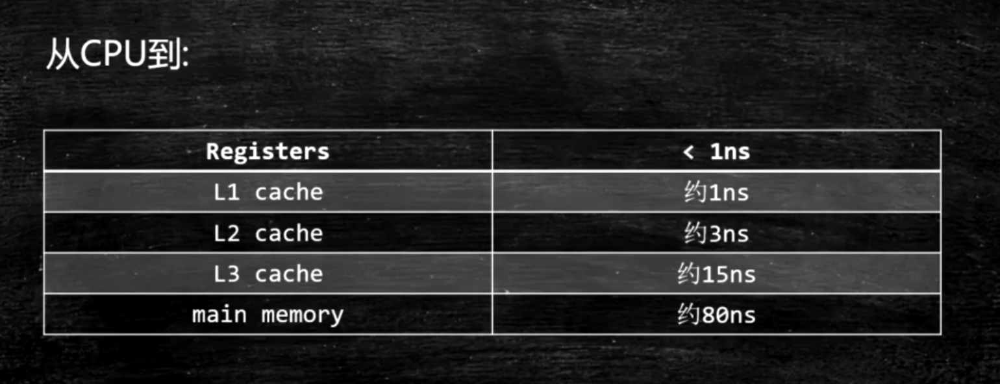
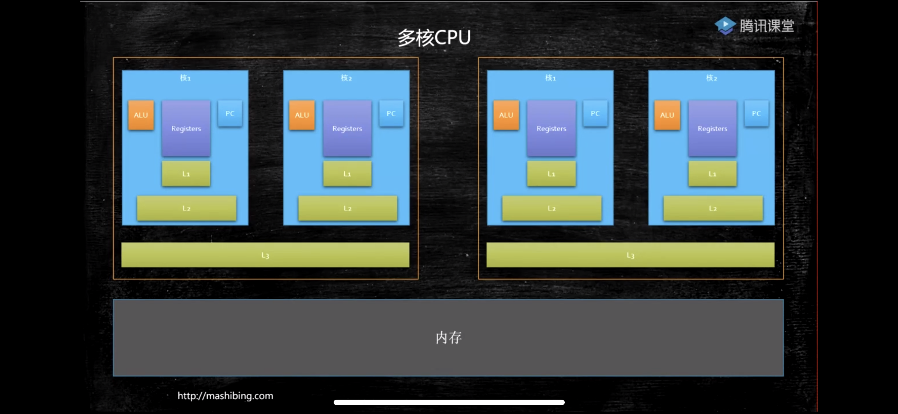
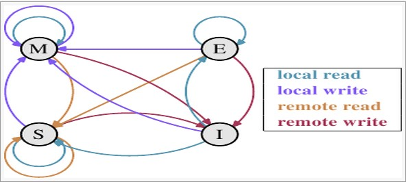
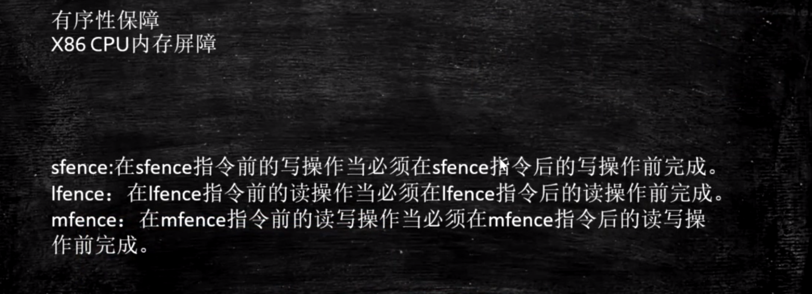
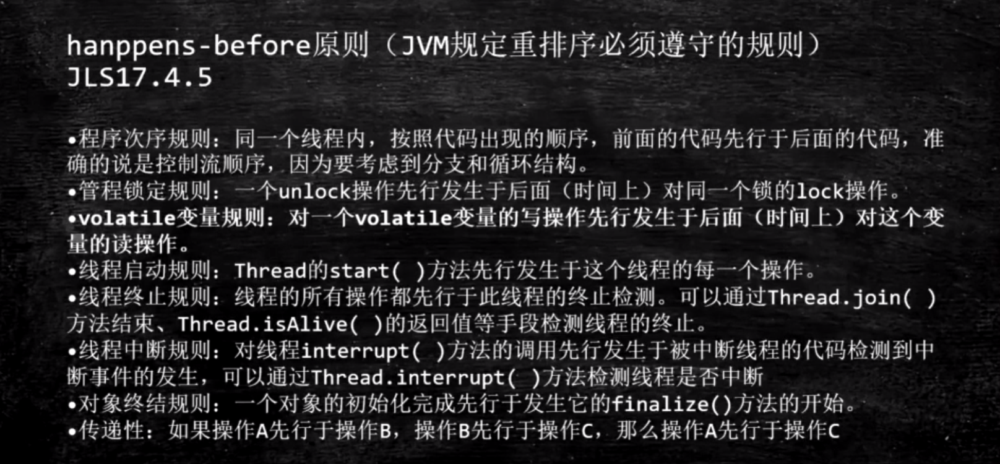
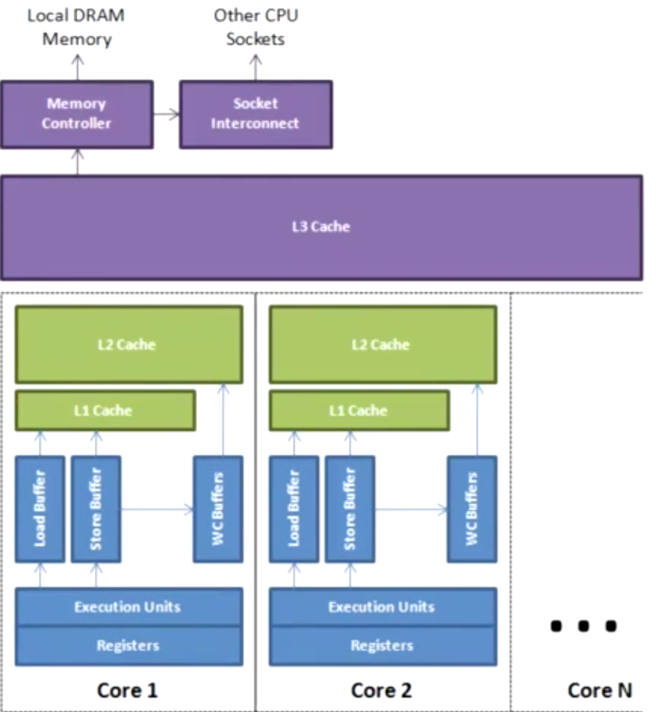
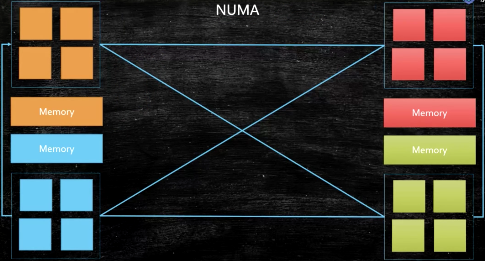

## CPU制作工序

沙子，熔炼，提纯，切片，渡膜，光刻，等上百道工序

参考资料：

Intel cpu的制作过程

https://haokan.baidu.com/v?vid=11928468945249380709&pd=bjh&fr=bjhauthor&type=video

 CPU是如何制作的（文字描述）

https://www.sohu.com/a/255397866_468626

## CPU工作原理

### 半导体

半导体其实就是介于导体和绝缘体中间的一种东西，比如二极管。


大致可以理解为，当C端10V,A端0V时，为断开，当A端10V,C端0V时，为导体。

### 与门，非门，或门，异或门

利用半导体，可以制作一些有趣的电路，如下图为与门，只有A端 B端都为10V时，Y端才是10V，如果以有电为1，断电为0的话，只有A，B都为1，Y输出才为1：


其余几种门的门电路简化成下面几个符号


### 最简单的CPU

#### 加法器1+1

最简单的加法器-实现功能，如下图，A，B代表0或1，输出端S是结果，而C则表示是不是发生进位了

四种情况，

A=1，B=1，则与门C=1，异或门S=0，结果为10

A=0，B=0，则与门C=0，异或门S=0，结果为0

A=0，B=1或A=1，B=0，则与门C=0，异或门S=1，结果为01，到此为止，算是完成了1以内的加减法了


#### 加法器1+2

完成了1+1过后，再来试试1+2，这里会出现进位问题，需要做进一步处理，如下图，


简化图如下：


#### 四位加法器

最多可以计算1111+1111了，就是15+15


#### 乘法

乘2就很简单了，对于一个2进制数数我们在后面加个0就算是乘2了

那乘3呢？简单，先位移一次（乘2）再加一次。乘5呢？先位移两次（乘4）再加一次。

所以一般简单的CPU是没有乘法的，而乘法则是通过位移和加算的组合来通过软件来实现的。


#### (A+B)X2 和 AX2+B

假设你有8位加法器了，也有一个位移1位的模块了。串起来你就能算(A+B)x2 了！

如果想计算AX2+B，需要重新接线，让A先过位移模块再进加法器

在这里，修改程序是要重新接线的


#### 触发器，寄存器，选择器，时钟发生器

##### 触发器，flip-flop


这个模块的作用是存储1bit数据。比如上面这个RS型的FF，R是Reset，输入1则清零。S是Set，输入1则保存1。RS都输入0的时候，会一直输出刚才保存的内容。

我们用FF来保存计算的中间数据（也可以是中间状态或者别的什么），1bit肯定是不够的，不过我们可以并联嘛，用4个或者8个来保存4位或者8位数据。这种我们称之为寄存器（Register）。

##### 选择器，MUX


sel输入0则输出i0的数据，i0是什么就输出什么，01皆可。同理sel如果输入1则输出i1的数据。当然选择器可以做的很长，比如这种四进一出的


有这个东西我们就可以给加法器和乘2模块（位移）设计一个激活针脚。

这个激活针脚输入1则激活这个模块，输入0则不激活。这样我们就可以控制数据是流入加法器还是位移模块了。

于是我们给CPU先设计8个输入针脚，4位指令，4位数据。

我们再设计三个指令：

0100，数据读入寄存器

0001，数据与寄存器相加，结果保存到寄存器

0010，寄存器数据向左位移一位（乘2）

我们可以为每个模块设计一个激活针脚。然后我们可以分别用指令输入的第二第三第四个针脚连接寄存器，加法器和位移器的激活针脚。

这样我们输入0100这个指令的时候，寄存器输入被激活，其他模块都是0没有激活，数据就存入寄存器了。同理，如果我们输入0001这个指令，则加法器开始工作，我们就可以执行相加这个操作了。


Q&A：

Q：CPU里面可能有成千上万个小模块，一个32位/64位的指令能控制那么多吗？

A：我们举例子的CPU里面只有3个模块，就直接接了。真正的CPU里会有一个解码器（decoder），把指令翻译成需要的形式。

Q：你举例子的简单CPU，如果我输入指令0011会怎么样？

A：当然是同时激活了加法器和位移器从而产生不可预料的后果，简单的说因为你使用了没有设计的指令，所以后果自负呗。（在真正的CPU上这么干大概率就是崩溃呗，当然肯定会有各种保护性的设计，死也就死当前进程）


再回头看上面的指令：

0001，数据与寄存器相加，结果保存到寄存器，这里有回写过程，一步做不出来，所以简易CPU也需要三步，读取指令，执行指令，写寄存器

经典的RISC设计则是分5步：读取指令(IF)，解码指令(ID)，执行指令(EX)，内存操作(MEM)，写寄存器(WB)。我们平常用的x86的CPU有的指令可能要分将近20个步骤。

可以理解有这么一个开关，我们啪的按一下，CPU就走一步，你按的越快CPU就走的越快，这个称为时钟发生器，这是CPU的心脏，推动着CPU的运行。


再回头看上面的指令：我们可以试试算一个(1+4)x2+3

```text
0100 0001 ；寄存器存入1
0001 0100 ；寄存器的数字加4
0010 0000 ；乘2
0001 0011 ；再加三
```

整理一下上面的指令：01000001000101000010000000010011

这种只有01组成的语言被称之为机器语言（机器码），是CPU唯一可以理解的语言，但是完全的反人类（以前的打孔计算机可能就是这样），于是我们把机器语言改成程序：

```text
0100 0001 ；寄存器存入1
0001 0100 ；寄存器的数字加4
0010 0000 ；乘2
0001 0011 ；再加三
```

改成：

```text
MOV   1 ；寄存器存入1
ADD   4 ；寄存器的数字加4
SHL   0 ；乘2（介于我们设计的乘法器暂时只能乘2，这个0是占位的）
ADD   3 ；再加三
```

这里汇编语言就出场了，汇编可以完美的改写成机器语言，直接指挥cpu，进行底层开发；我们也可以把内存中的数据dump出来，以汇编语言的形式展示出来，方便调试和debug

汇编语言的本质：机器语言的助记符 其实它就是机器语言

计算机通电 -> CPU读取内存中程序（电信号输入）

->时钟发生器不断震荡通断电 ->推动CPU内部一步一步执行

（执行多少步取决于指令需要的时钟周期）

->计算完成->写回（电信号）->写给显卡输出（sout，或者图形）


不过这里暂时不讨论汇编语言了

参考内容：

https://www.zhihu.com/question/348237008/answer/843382847

http://mashibing.com/doc/


计算机需要解决的最根本问题：如何代表数字

晶体管是如何工作的：

[https://haokan.baidu.com/v?vid=16026741635006191272&pd=bjh&fr=bjhauthor&type=](https://haokan.baidu.com/v?vid=16026741635006191272&pd=bjh&fr=bjhauthor&type=video)[video](https://haokan.baidu.com/v?vid=16026741635006191272&pd=bjh&fr=bjhauthor&type=video)

晶体管的工作原理：

https://www.bilibili.com/video/av47388949?p=2

## CPU基本组成

PC -> Program Counter 程序计数器（记录当前指令地址）

Registers -> 寄存器，暂时存储CPU计算需要用到的数据

ALU -> Arithmetic & Logic Unit 运算单元

CU -> Control Unit 控制单元 - 和中断相关等

MMU -> Memory Management Unit 内存管理单元

Cache -> CPU缓存


## CPU缓存

### 存储器的层次结构

CPU从寄存器中取数据，速度基本是从主存中取数据的100倍




在多核CPU中，每颗CPU中的每个核，单独享有L1，L2级缓存，每个CPU里的多个核共享L3级缓存，多个CPU共享主存，如下图所示：




### 超线程

这里表示在一个CPU内部，拥有两对Registers, PC，可以同时执行两个线程中的指令，寄存器里读写数据极快，不需要再把1线程拿出去，把2线徎拿进来


### 缓存行

CPU在进行运算时读取数据，并不是需要多少字节就读多少字节，而是会把需要的数据以及相邻的数据一起读到寄存器，一块一块读取，这样可以充分发挥总线，CPU针脚一次性读取更多数据的能力，称之为缓存行，

缓存行越大，局部性空间效率越高，但读取时间慢

缓存行越小，局部性空间效率越低，但读取时间快

取一个折中值，目前多用：64字节

#### 缓存一致性协议

##### MESI

CPU中每个缓存行使用四种状态进行标记，`MESI` (也称为伊利诺斯协议，是因为该协议由伊利诺斯州立大学提出）是一种广泛使用的支持写回策略的缓存一致性协议。

M：被修改（Modified)	该缓存行只被缓存在该`CPU`的缓存中，并且是被修改过的（`dirty`),即与主存中的数据不一致，该缓存行中的内存需要在未来的某个时间点（允许其它`CPU`读取请主存中相应内存之前）写回（`write back`）主存。

当被写回主存之后，该缓存行的状态会变成独享（`exclusive`)状态。

E：独享（Exclusive)	该缓存行只被缓存在该`CPU`的缓存中，它是未被修改过的（`clean`)，与主存中数据一致。该状态可以在任何时刻当有其它`CPU`读取该内存时变成共享状态（`shared`)。

同样地，当`CPU`修改该缓存行中内容时，该状态可以变成`Modified`状态。

S：共享的（Shared)	该状态意味着该缓存行可能被多个`CPU`缓存，并且各个缓存中的数据与主存数据一致（`clean`)，当有一个`CPU`修改该缓存行中，其它`CPU`中该缓存行可以被作废（变成无效状态（`Invalid`））。

I：无效的（Invalid）该缓存是无效的（可能有其它`CPU`修改了该缓存行）。



状态之间的相互转换关系可以由下图表示：


#### 伪共享

当内存中存在两个数据A，B在同一缓存行，同时存在X，Y两个线程对他们进行读取，X不断更新A的值，Y不断更新B的值，导致线程X，Y必须不停通知对方，缓存行数据已经处于`dirty`状态，两线程不断重复读取导致执行效率下降。

#### 缓存行对齐

对于有些特别敏感的数字，会存在线程高竞争的访问，为了保证不发生伪共享，可以使用缓存行对齐的编程方式

JDK7中，很多采用long padding提高效率

JDK8，加入了@Contended注解（实验）需要加上：JVM -XX:-RestrictContended

参考资料：

一致性协议：https://www.cnblogs.com/z00377750/p/9180644.html


## CPU乱序执行

### 什么是乱序执行

由于内存相对于CPU的速度实在是太慢了，CPU经常在等待从内存读取数据时，在不影响运行结果的情况下，提前运行下一条指令。

### 如何证明CPU存在乱序执行

执行下面这段小程序：

当出现x, y同时为0的时候，证明x=b，y=a在a=1，b=1前面执行

```java
package com.qinsheng.jvm;

public class Disorder {
    private static int x = 0, y = 0;
    private static int a = 0, b =0;

    public static void main(String[] args) throws InterruptedException {
        int i = 0;
        for(;;) {
            i++;
            x = 0; y = 0;
            a = 0; b = 0;
            Thread one = new Thread(new Runnable() {
                public void run() {
                    a = 1;
                    x = b;
                }
            });

            Thread other = new Thread(new Runnable() {
                public void run() {
                    b = 1;
                    y = a;
                }
            });
            one.start();other.start();
            one.join();other.join();
            String result = "第" + i + "次 (" + x + "," + y + "）";
            if(x == 0 && y == 0) {
                System.err.println(result);
                break;
            } else {
            }
        }
    }
}
```

### 禁止乱序

在CPU层面，以Intel为例，使用原语(mfence lfence sfence) 或者锁总线来禁止指令重排序



在JVM中，8个hanppens-before原则 



4个内存屏障 （LL LS SL SS）这是JVM定义的规范，不同的虚拟机，对底层不同的CPU有不同的实现方式，Hospot是直接锁总线来禁止指令重排序

## 合并写

Write Combining Buffer

一般是4个字节

由于ALU速度太快，所以在写入L1的同时，写入一个WC Buffer，满了之后，再直接更新到L2级缓存。



## NUMA

Non Uniform Memory Access

ZGC - NUMA aware 

分配内存会优先分配该线程所在CPU的最近内存



