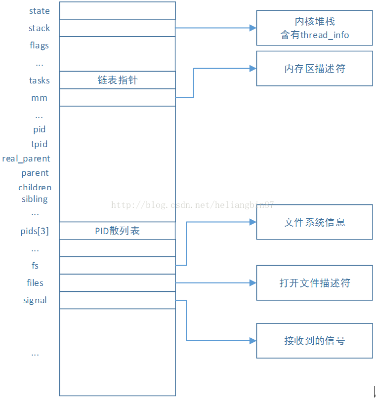
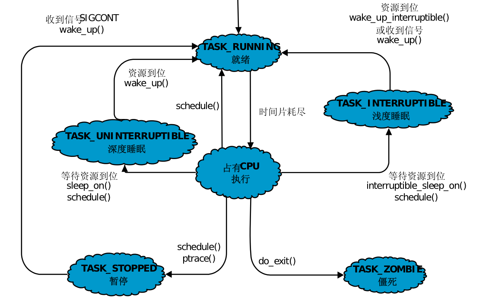
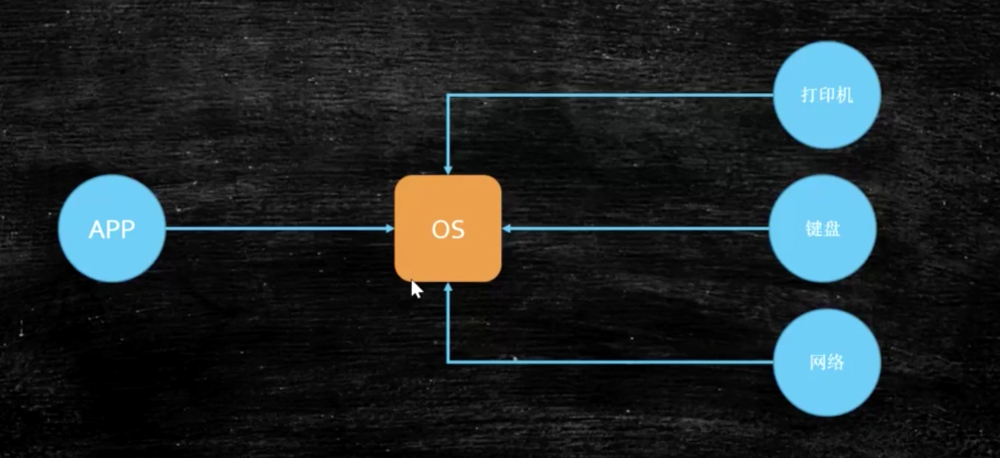
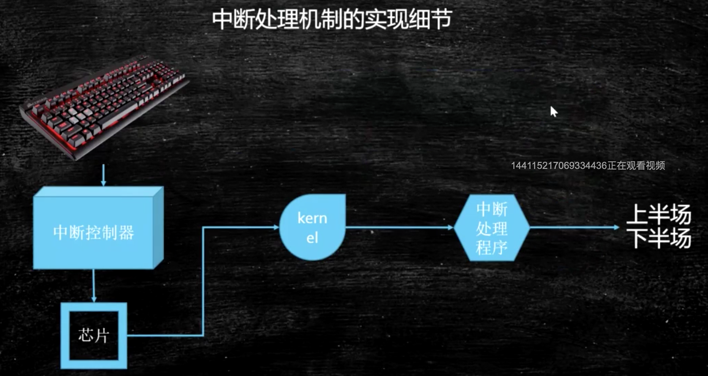
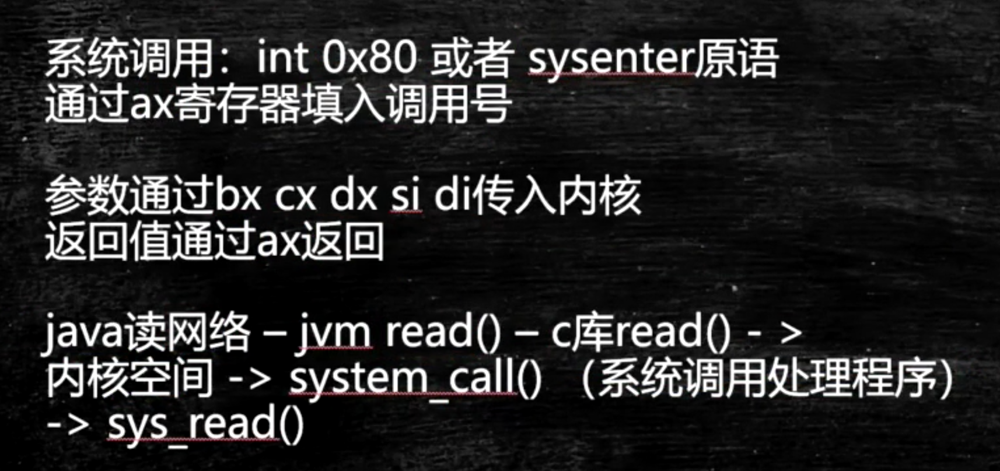
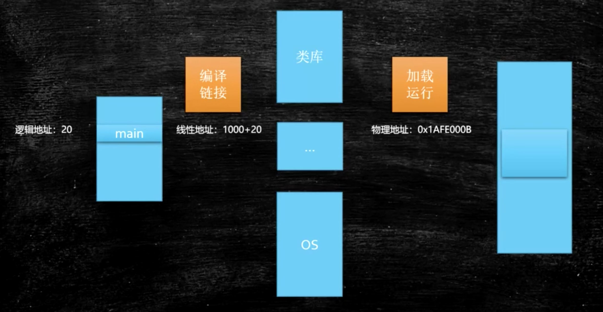
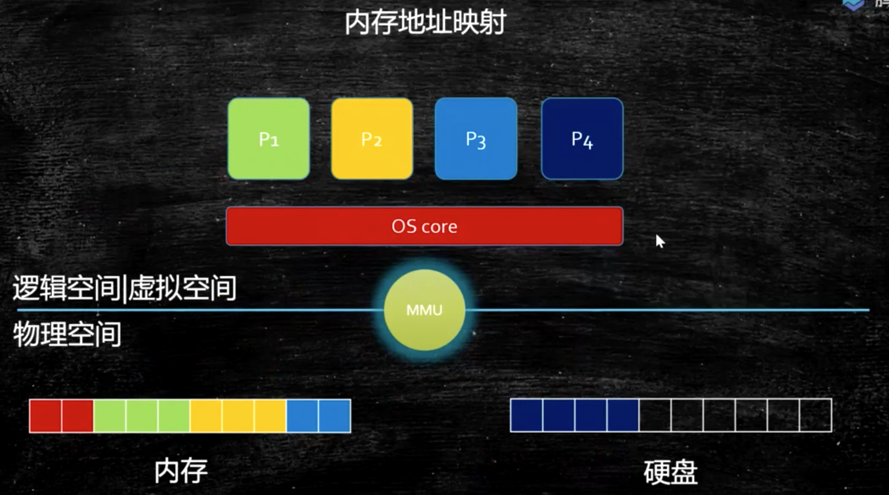

## 从硬件到软件-开机

开机过程：

通电 -> bios uefi 工作 -> 自检 -> 到硬盘固定位置加载bootloader -> 读取可配置信息 -> CMOS（由电池供电）

在操作系统启动完成后，所有的一切硬件由操作系统来管理，包括CPU

## 操作系统

开机后，计算机可以做的所有事情，都由操作系统来控制，

CPU调度，内存管理，中断处理、设备驱动，文件系统，应用管理、进程调度

### 内核分类

微内核 -> 只负责进程调度，弹性部署，比如智能家居，需要5G支持 5G IoT

宏内核 -> 负责管理所有事情，现在主要用的

### 用户态和内核态

CPU分不同的指令级别，Ring0-3

在Linux系统中，内核态在Ring0级，用户态在Ring3级，用户需要对系统的关键访问，需要经过kernel的同意，保证系统健壮性

内核执行的操作 - > 200多个系统调用 sendfile read write pthread fork

## 进程 线程 纤程 中断 - Linux

### 进程

#### 进程的概念

Linux中也称为task，是系统分配资源的基本单位，这里的资源包括独立的内存空间，内核数据结构（进程描述符），全局变量，数据段。。。

每个进程执行一段独立的程序并且在进程初始化的时候拥有一个独立的控制线程。换句话说，每一个进程都拥有一个独立的程序计数器，用这个这个程序计数器可以追踪下一条将要被执行的指令。

##### 进程标识符 PID

每个进程都有一个唯一的标识符（PID），内核通过这个标识符来识别不同的进程，同时，进程标识符(PID)也是内核提供给用户程序的接口，用户程序通过PID对进程发号施令。

PID是32位的无符号整数，它被顺序编号：新创建进程的PID通常是前一个进程的PID加1。然而，为了与16位硬件平台的传统Linux系统保持兼容，在Linux上允许的最大PID号是32767，当内核在系统中创建第32768个进程时，就必须重新开始使用已闲置的PID号。在64位系统中，PID可扩展到4194303。

##### 进程控制块 PCB

所有的进程都被放在一个叫做进程控制块（PCB）的数据结构中，可以理解为进程属性的集合，该控制块由操作系统创建和管理。每个进程在内核中都有一个进程控制块来维护进程相关的信息，Linux内核的进程控制块是（task_struct）结构体。

##### 进程描述符 task_struct

内核把进程的列表存放在叫做任务队列的双向循环链表中。链表中的每一个项都是类型为task_struct（即进程描述符的结构），它包含了一个具体进程的所有相关信息。通过slab分配器分配task_struct结构，这样方便对象复用和缓存着色。该结构体有些大，下图只是指出其中比较重要的成员部分。



#### 进程的创建

Linux创建进程分解到两个单独的函数中去执行：fork()和exec()。首先，fork()通过拷贝当前进程创建一个子进程，子进程与父进程的区别仅仅在于PID、PPID和某些资源和统计量。exec()函数负责读取可执行文件并载入地址空间开始运行。

#### 进程状态

TASK_RUNNING表示进程要么正在执行，要么正要准备执行。

TASK_INTERRUPTIBLE表示进程被阻塞（睡眠），直到某个条件变为真。条件一旦达成，进程的状态就被设置为TASK_RUNNING。

TASK_UNINTERRUPTIBLE的意义与TASK_INTERRUPTIBLE类似，除了不能通过接受一个信号来唤醒以外。

__TASK_STOPPED表示进程被停止执行。

__TASK_TRACED表示进程被debugger等进程监视。

EXIT_ZOMBIE表示进程的执行被终止，但是其父进程还没有使用wait()等系统调用来获知它的终止信息。

EXIT_DEAD表示进程的最终状态。

EXIT_ZOMBIE和EXIT_DEAD也可以存放在exit_state成员中



僵尸进程	上图中的僵死状态，表示进程的执行被终止，但是其父进程还没有使用 wait() 等系统调用来获知它的终止信息。

孤儿进程	子进程还在执行，父进程已经退出，操作系统内核会重新给孤儿进程赋父进程。

参考资料：

https://blog.csdn.net/m0_37973607/article/details/80786549

https://blog.csdn.net/heliangbin87/article/details/77441908

### 进程和线程的区别

进程就是一个程序运行起来的状态，线程是一个进程中的不同的执行路径

进程是OS分配资源的基本单位，线程是执行调度的基本单位，分配资源最重要的是独立的内存空间，线程调度执行（线程共享进程的内存空间，没有自己独立的内存空间）

### 纤程

#### 什么是纤程

用户态的线程，线程中的线程，切换和调度是不需要经过OS的

#### 纤程的优势

1，占有资源很少，OS启动一个线程可能需要1M空间，但是启动一个纤程只需要4K

2，纤程切换比较简单，不用CPU将线程相关的register，PC移除出去，再换另外一个线程进来执行，CPU的线程切换是重量级的。

3，纤程可以启动很多没问题，10W+不会有问题，线程不行，即使可以，大量的CPU资源也是浪费在线程切换上

#### 应用场景

并发量高，且需要处理的是短的计算任务，不需要和内核打交道的

#### 实验

Java本身不支持纤程，可以通过引入类库来实现，利用Quaser库（不成熟）

以下三个小程序，可以比较单线程，多线程，多纤程的效率，需要jdk10以上好像，本地没有跑起来，暂不深究。

```xml 
<dependency>
		<groupId>co.paralleluniverse</groupId>
    <artifactId>quasar-core</artifactId>
    <version>0.8.0</version>
</dependency>
```

```java
package com.qinsheng.fiber;

import co.paralleluniverse.fibers.Fiber;
import co.paralleluniverse.fibers.SuspendExecution;
import co.paralleluniverse.strands.SuspendableRunnable;

public class MultiFiber {

    public static void main(String[] args) throws Exception{
        long start = System.currentTimeMillis();
        int size = 10000;
        Fiber<Void>[] fibers = new Fiber[size];
        for (int i = 0; i < fibers.length; i++) {
            fibers[i] = new Fiber<Void>(new SuspendableRunnable() {
                public void run() throws SuspendExecution, InterruptedException {
                    calc();
                }
            });
        }
        for (int i = 0; i < fibers.length; i++) {
            fibers[i].start();
        }
        for (int i = 0; i < fibers.length; i++) {
            fibers[i].join();
        }
        long end = System.currentTimeMillis();
        System.out.println(end - start);
    }

    static void calc() {
        int result = 0;
        for (int m = 0; m < 10000; m++) {
            for (int i = 0; i < 200; i++) {
                result += i;
            }
        }
    }

}

```

```java
package com.qinsheng.fiber;

public class MultiThread {

    public static void main(String[] args) throws Exception{
        long start = System.currentTimeMillis();
        Runnable r = new Runnable() {
            @Override
            public void run() {
                calc();
            }
        };

        int size = 10000;
        Thread[] threads = new Thread[size];

        for (int i = 0; i < threads.length; i++) {
            threads[i] = new Thread(r);
        }
        for (int i = 0; i < threads.length; i++) {
            threads[i].start();
        }
        for (int i = 0; i < threads.length; i++) {
            threads[i].join();
        }

        long end = System.currentTimeMillis();
        System.out.println(end - start);
    }

    public static void calc(){
        int result = 0;
        for (int m = 0; m < 10000; m++) {
            for (int i = 0; i < 200; i++) {
                result += i;
            }
        }
    }

}

```

### 中断





硬中断 -> 来自硬件的中断

软中断 -> 软件的系统调用 int 0x80 或者 sysenter原语,

通过ax寄存器填入调用号

参数通过bx cx dx si di传入内核

返回值通过ax返回



## <font color='red'>进程调度</font>

内核进程调度器决定：该哪一个进程运行，何时开始，运行多长时间，原则：最大限度的压榨CPU资源

抢占式任务调度 - 除非主动让出CPU

非抢占式任务调度 - 进程调度器决定执行哪个任务

##### 调度策略

2.5，每个进程都公平的执行一个时间片，经典Unix O(1)调度策略。偏向服务器，但对交互不友好 

2.6以后，按优先级分配时间片的比例，记录每个进程的执行时间，如果有一个进程执行时间不到他应该分配的比例，优先执行

进程类型

IO密集型

Cpu密集型

默认调度策略

实时进程	优先级分高低FIFO，优先级一样采用RR（Round Robin）轮询	->急诊

普通进程	CFS Completely Fair Scheduler

## <font color='red'>内存管理</font>






### 内存管理需要解决的两大问题

#### 内存已满

如果在程序启动时，将程序的所有数据全部加载到内存中，这样会很容易将内存撑满，解决方法是将程序和内存全部以4k为单位，需要的数据才进行加载，如果内存已满，下一个加载进来的将会把最近最少用的那一块内存挤出去

##### 著名的LRU算法（Least Recent Used）

在O(1)的时间复杂度里实现，使用双向链表和HashMap，Java里对应的实现是LinkedHashMap

#### 进程间的互相打扰

为了防止进程间内存的互相打扰，引入了虚拟内存，由虚拟内存映射到真正的物理内存，每个进程访问的都是自己的虚拟内存，真正映射的物理地址，只有内核知道，这样就避免了互相打扰